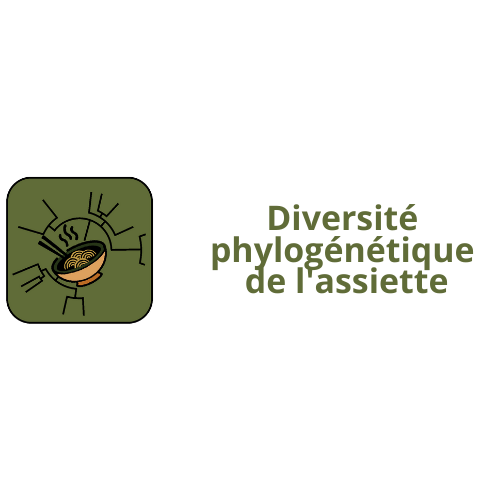

# Diversité phylogénétique: de l'assiette au jardin

{:.center}


This project provide a tool to explore phylogenetic diversity of recipes by the french cooking website [marmiton.org](https://www.marmiton.org/). In this proposal we have develop a gui-based version and a cli-based version.

## Requirements:
- python (please use system's Python and not Python under Anaconda)
- pip3, you can install it running the following command:
```
sudo apt-get install python3-pip
```

- pipenv, you can install it running the following command:
```
sudo apt-get install pipenv
```


## Before using, execute the following lines in your clone repo:

```
pipenv shell # create/activate a virtual environment using the repository
```

```
pipenv install -r requirements.txt # install all dependencies
```


Run `exit` to quit the venv.


## To execute the program:

```
python3 GUI.py # for application with graphic interface
```

or
```
python3 main.py # for the command line program</code>
```


Work on marmiton.org version of 26/04/2021


Contributors:
    - Barberis Tommaso
    - Deguise Victor
    - Frouté Timothée

(fork by http://pedago-service.univ-lyon1.fr:2325/tfroute/div-phylo-alim)
