Import libraries
================

Collect data
============

### Vegetarian

    dta_vege <- read.csv("/home/tommaso/diversite-phylogenetique-de-l-assiette-au-jardin/results/Vegetarian/vegetarian_results.tsv", header=TRUE, sep="\t", fill=T)
    summary(dta_vege)

    ##                                                             Recipe   
    ##  Tourte de Noël végétarienne de Coralie                        : 16  
    ##  Burger végétarien aux lentilles                               : 14  
    ##  Ragoût végétarien aux légumes                                 : 14  
    ##  Tarte provençale fine, light, végétarienne, économique, rapide: 14  
    ##  Couscous végétarien facile                                    : 13  
    ##  Paëlla végétarienne                                           : 13  
    ##  (Other)                                                       :219  
    ##          Ingredient            Specie       Quantity     Dry_matter 
    ##  Poivre       : 21   Bos taurus   : 30   1 g    : 43   0.91 g : 21  
    ##  Sel          : 19   Piper nigrum : 22   30 g   : 24   1.0 g  : 19  
    ##  Oignon       : 18   Allium cepa  : 18   120 g  : 18   12.48 g: 11  
    ##  Ail          : 12   Gallus gallus: 14   200 g  : 17   18.96 g:  7  
    ##  Huile d'olive: 12   Olea europaea: 13   5 g    : 17   0.42 g :  6  
    ##  Oeuf         : 12   (Other)      :156   80 g   : 17   (Other):231  
    ##  (Other)      :209   NA's         : 50   (Other):167   NA's   :  8  
    ##      Energy         Water          Glucides         Lipids      
    ##  Min.   :   0   Min.   : 0.00   Min.   : 0.00   Min.   :  0.00  
    ##  1st Qu.: 169   1st Qu.: 9.00   1st Qu.: 1.80   1st Qu.:  0.36  
    ##  Median : 617   Median :67.35   Median : 6.25   Median :  0.63  
    ##  Mean   :1026   Mean   :51.56   Mean   :15.01   Mean   : 14.93  
    ##  3rd Qu.:1460   3rd Qu.:88.10   3rd Qu.:19.40   3rd Qu.: 11.28  
    ##  Max.   :3700   Max.   :98.00   Max.   :99.80   Max.   :100.00  
    ##  NA's   :68     NA's   :7       NA's   :19      NA's   :7       
    ##     Proteins         Richness      Phylogenetic_diversity
    ##  Min.   : 0.000   Min.   : 4.000   Min.   :104.0         
    ##  1st Qu.: 1.060   1st Qu.: 6.000   1st Qu.:169.3         
    ##  Median : 2.940   Median : 7.000   Median :197.1         
    ##  Mean   : 5.672   Mean   : 8.231   Mean   :224.4         
    ##  3rd Qu.: 9.223   3rd Qu.:10.000   3rd Qu.:281.5         
    ##  Max.   :31.100   Max.   :15.000   Max.   :409.4         
    ##  NA's   :7                                               
    ##  Weighted_phylogenetic_diversity    Shannon          Simpson      
    ##  Min.   :16.71                   Min.   :-1.880   Min.   : 0.110  
    ##  1st Qu.:19.34                   1st Qu.: 0.980   1st Qu.: 0.760  
    ##  Median :26.59                   Median : 1.350   Median : 2.060  
    ##  Mean   :26.94                   Mean   : 1.247   Mean   : 2.906  
    ##  3rd Qu.:32.14                   3rd Qu.: 2.010   3rd Qu.: 4.140  
    ##  Max.   :39.93                   Max.   : 3.370   Max.   :10.550  
    ##  NA's   :9                       NA's   :9        NA's   :9       
    ##                                                                                                               URL     
    ##  https://www.marmiton.org/recettes/recette_tourte-de-noel-vegetarienne-de-coralie_15536.aspx                    : 16  
    ##  https://www.marmiton.org/recettes/recette_burger-vegetarien-aux-lentilles_345408.aspx                          : 14  
    ##  https://www.marmiton.org/recettes/recette_ragout-vegetarien-aux-legumes_65191.aspx                             : 14  
    ##  https://www.marmiton.org/recettes/recette_tarte-provencale-fine-light-vegetarienne-economique-rapide_38642.aspx: 14  
    ##  https://www.marmiton.org/recettes/recette_couscous-vegetarien-facile_62233.aspx                                : 13  
    ##  https://www.marmiton.org/recettes/recette_paella-vegetarienne_47534.aspx                                       : 13  
    ##  (Other)                                                                                                        :219

### Top

    dta_top <- read.csv("/home/tommaso/diversite-phylogenetique-de-l-assiette-au-jardin/results/Top/top_results.tsv", header=TRUE, sep="\t", fill=T)
    summary(dta_top)

    ##                                                  Recipe            Ingredient 
    ##  Lapin à la moutarde maison                         : 13   Sel          : 21  
    ##  Boeuf braisé aux carottes                          : 12   Poivre       : 20  
    ##  Hachis Parmentier                                  : 12   Oignon       : 15  
    ##  La Vraie Moussaka Grecque                          : 12   Ail          : 11  
    ##  Lasagnes à la bolognaise                           : 12   Beurre       : 10  
    ##  Blanc de poulet aux endives, champignons et lardons: 11   Crème fraîche:  9  
    ##  (Other)                                            :199   (Other)      :185  
    ##             Specie       Quantity     Dry_matter      Energy      
    ##  Bos taurus    : 42   1 g    : 44   1.0 g  : 21   Min.   :   0.0  
    ##  Piper nigrum  : 20   5 g    : 26   0.91 g : 20   1st Qu.: 170.0  
    ##  Allium cepa   : 19   200 g  : 18   12.48 g:  7   Median : 618.0  
    ##  Allium sativum: 11   30 g   : 16   0.72 g :  6   Mean   : 985.4  
    ##  Gallus gallus : 11   50 g   : 15   12.2 g :  6   3rd Qu.:1380.0  
    ##  (Other)       :117   15 g   : 14   (Other):188   Max.   :3700.0  
    ##  NA's          : 51   (Other):138   NA's   : 23   NA's   :64      
    ##      Water           Glucides         Lipids          Proteins     
    ##  Min.   : 0.027   Min.   : 0.00   Min.   :  0.00   Min.   : 0.000  
    ##  1st Qu.: 9.000   1st Qu.: 1.01   1st Qu.:  0.50   1st Qu.: 0.715  
    ##  Median :65.100   Median : 4.04   Median :  1.55   Median : 3.175  
    ##  Mean   :50.736   Mean   :13.10   Mean   : 14.31   Mean   : 6.641  
    ##  3rd Qu.:86.675   3rd Qu.:17.25   3rd Qu.: 13.60   3rd Qu.:12.700  
    ##  Max.   :98.100   Max.   :99.80   Max.   :100.00   Max.   :31.100  
    ##  NA's   :21       NA's   :35      NA's   :22       NA's   :21      
    ##     Richness      Phylogenetic_diversity Weighted_phylogenetic_diversity
    ##  Min.   : 3.000   Min.   :102.0          Min.   :22.77                  
    ##  1st Qu.: 6.000   1st Qu.:182.9          1st Qu.:28.63                  
    ##  Median : 7.000   Median :213.7          Median :31.75                  
    ##  Mean   : 7.114   Mean   :217.1          Mean   :32.34                  
    ##  3rd Qu.: 8.000   3rd Qu.:263.7          3rd Qu.:37.20                  
    ##  Max.   :11.000   Max.   :314.4          Max.   :40.72                  
    ##                                          NA's   :37                     
    ##     Shannon          Simpson      
    ##  Min.   :-5.100   Min.   : 0.130  
    ##  1st Qu.:-0.100   1st Qu.: 0.540  
    ##  Median : 1.590   Median : 1.620  
    ##  Mean   : 0.485   Mean   : 4.621  
    ##  3rd Qu.: 1.950   3rd Qu.: 6.270  
    ##  Max.   : 3.120   Max.   :20.720  
    ##  NA's   :37       NA's   :37      
    ##                                                                                                       URL     
    ##  https://www.marmiton.org/recettes/recette_lapin-a-la-moutarde-maison_15983.aspx                        : 13  
    ##  https://www.marmiton.org/recettes/recette_boeuf-braise-aux-carottes_13296.aspx                         : 12  
    ##  https://www.marmiton.org/recettes/recette_hachis-parmentier_17639.aspx                                 : 12  
    ##  https://www.marmiton.org/recettes/recette_la-vraie-moussaka-grecque_72593.aspx                         : 12  
    ##  https://www.marmiton.org/recettes/recette_lasagnes-a-la-bolognaise_18215.aspx                          : 12  
    ##  https://www.marmiton.org/recettes/recette_blanc-de-poulet-aux-endives-champignons-et-lardons_35733.aspx: 11  
    ##  (Other)                                                                                                :199

### Dessert

    dta_dessert <- read.csv("/home/tommaso/diversite-phylogenetique-de-l-assiette-au-jardin/results/Dessert/dessert_results.tsv", header=TRUE, sep="\t", fill=T)
    summary(dta_dessert)

    ##                                               Recipe           Ingredient
    ##  Pain d'épices                                   : 11   Oeuf        :20  
    ##  Baba au rhum express                            :  8   Farine      :15  
    ##  Bavarois aux fraises sur génoise                :  8   Beurre      : 9  
    ##  Cheese cake (gâteau au fromage blanc) inratable :  8   Sucre       : 7  
    ##  Chouquettes                                     :  8   Beurre doux : 5  
    ##  Tarte à la rhubarbe rapide                      :  8   Jaune d'oeuf: 5  
    ##  (Other)                                         :107   (Other)     :97  
    ##                Specie      Quantity     Dry_matter      Energy    
    ##  Bos taurus       :33   100 g  :19   56.88 g :  9   Min.   :   0  
    ##  Gallus gallus    :28   5 g    :19   131.25 g:  7   1st Qu.: 245  
    ##  Saccharum        :25   150 g  :13   37.92 g :  7   Median : 996  
    ##  Triticum aestivum:15   240 g  : 9   99.83 g :  6   Mean   :1190  
    ##  Citrus limon     : 4   1 g    : 7   1.0 g   :  5   3rd Qu.:1480  
    ##  (Other)          :33   160 g  : 7   (Other) :118   Max.   :3700  
    ##  NA's             :20   (Other):84   NA's    :  6   NA's   :45    
    ##      Water          Glucides         Lipids          Proteins      
    ##  Min.   : 0.00   Min.   : 0.00   Min.   :  0.00   Min.   : 0.0000  
    ##  1st Qu.: 5.40   1st Qu.: 0.85   1st Qu.:  0.20   1st Qu.: 0.5775  
    ##  Median :15.60   Median : 4.90   Median :  1.00   Median : 1.9600  
    ##  Mean   :38.83   Mean   :29.54   Mean   : 15.99   Mean   : 5.8949  
    ##  3rd Qu.:76.30   3rd Qu.:73.70   3rd Qu.:  9.83   3rd Qu.: 9.0300  
    ##  Max.   :97.80   Max.   :99.80   Max.   :100.00   Max.   :86.9000  
    ##  NA's   :6       NA's   :4       NA's   :4        NA's   :4        
    ##     Richness     Phylogenetic_diversity Weighted_phylogenetic_diversity
    ##  Min.   :1.000   Min.   :  1.0          Min.   : 1.00                  
    ##  1st Qu.:4.000   1st Qu.:159.3          1st Qu.:31.48                  
    ##  Median :4.000   Median :196.0          Median :35.34                  
    ##  Mean   :4.589   Mean   :183.2          Mean   :34.94                  
    ##  3rd Qu.:5.750   3rd Qu.:217.2          3rd Qu.:39.82                  
    ##  Max.   :7.000   Max.   :255.3          Max.   :47.00                  
    ##                                         NA's   :12                     
    ##     Shannon           Simpson      
    ##  Min.   :-7.7400   Min.   : 0.070  
    ##  1st Qu.:-0.3900   1st Qu.: 1.927  
    ##  Median : 0.2450   Median : 3.260  
    ##  Mean   :-0.4466   Mean   : 5.693  
    ##  3rd Qu.: 0.8450   3rd Qu.: 4.960  
    ##  Max.   : 2.0000   Max.   :27.880  
    ##  NA's   :12        NA's   :12      
    ##                                                                                                  URL     
    ##  https://www.marmiton.org/recettes/recette_pain-d-epices_11087.aspx                                : 11  
    ##  https://www.marmiton.org/recettes/recette_baba-au-rhum-express_13608.aspx                         :  8  
    ##  https://www.marmiton.org/recettes/recette_bavarois-aux-fraises-sur-genoise_58126.aspx             :  8  
    ##  https://www.marmiton.org/recettes/recette_cheese-cake-gateau-au-fromage-blanc-inratable_20518.aspx:  8  
    ##  https://www.marmiton.org/recettes/recette_chouquettes_30622.aspx                                  :  8  
    ##  https://www.marmiton.org/recettes/recette_tarte-a-la-rhubarbe-rapide_22715.aspx                   :  8  
    ##  (Other)                                                                                           :107

Removing “g” from “dry\_matter” column
======================================

    remove_grams <- function (d) {
      d$Dry_matter <- as.numeric(sapply(d$Dry_matter, sub, pattern=" g", replacement=""))
      return(d)
    }
    dta_vege <- remove_grams(dta_vege)
    dta_top <- remove_grams(dta_top)
    dta_dessert <- remove_grams(dta_dessert)

Trim and grouping by recipe
===========================

    trim_group_data <- function (d) {
      return(
        subset(d, Richness > 2) %>% group_by(Recipe)
      )
    }

    vege_by_recipe <- trim_group_data(dta_vege)
    top_by_recipe <- trim_group_data(dta_top)
    dessert_by_recipe <- trim_group_data(dta_dessert)

Summarize of recipes
====================

    summarise_by_mean <- function (d) {
      return( d %>% summarise(
        Water = mean(x=Water, na.rm = T), 
        Glucides = weighted.mean(x=Glucides, w=Dry_matter, na.rm = T),
        Lipids = weighted.mean(x=Lipids, w=Dry_matter, na.rm = T),
        Proteins = weighted.mean(x=Proteins, w=Dry_matter, na.rm = T),
        Energy =  weighted.mean(x=Energy, w=Dry_matter, na.rm = T), 
        Phylogenetic_diversity = mean(Phylogenetic_diversity, na.rm = T),
        Weighted_phylogenetic_diversity = mean(Weighted_phylogenetic_diversity, na.rm = T),
        Richness = mean(Richness, na.rm = T),
        Shannon = mean(Shannon, na.rm = T),
        Simpson = mean(Simpson, na.rn = T)
      )
      )
    }

    vege_simple <- summarise_by_mean(vege_by_recipe)
    vege_simple$type <- "Vegetarian"
    top_simple <- summarise_by_mean(top_by_recipe)
    top_simple$type <- "Top"
    dessert_simple <- summarise_by_mean(dessert_by_recipe)
    dessert_simple$type <- "Dessert"

Histograms
==========

### Phylogenetic diversity

    par(mfrow=c(3,1), mar=c(4,3,0,0))
    bins <- seq(0, 500, by=50)
    hist(vege_simple$Phylogenetic_diversity, ylim=c(0, 15), xlim=c(50, 350), main="", xlab="Vegetarian", col=rgb(0,1,0,0.3), breaks=bins, axes=F)
    axis(side=1, at=bins, labels=bins)
    axis(side=2, at=c(0,5,10,15), labels=c(0,5,10,15))
    hist(top_simple$Phylogenetic_diversity, col=rgb(1, 0, 0, 0.3), ylim=c(0, 15), xlim=c(50, 350), main="", xlab="Top", breaks=bins, axes=F)
    axis(side=1, at=bins, labels=bins)
    axis(side=2, at=c(0,5,10,15), labels=c(0,5,10,15))
    hist(dessert_simple$Phylogenetic_diversity, col=rgb(0, 0, 1, 0.3), ylim=c(0, 15), xlim=c(50, 350), main="", xlab="Desserts", breaks=bins, axes=F)
    axis(side=1, at=bins, labels=bins)
    axis(side=2, at=c(0,5,10,15), labels=c(0,5,10,15))

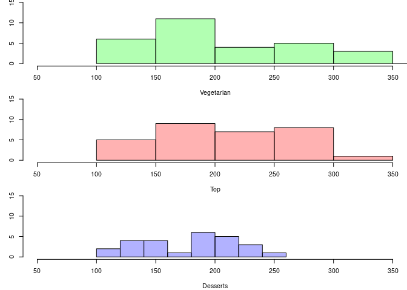

### Weighted phylogenetic diversity

    par(mfrow=c(3,1), mar=c(4,3,0,0))
    bins <- seq(0, 50, by=5)
    hist(vege_simple$Weighted_phylogenetic_diversity, ylim=c(0, 15), xlim=c(0, 60), main="", xlab="Vegetarian", col=rgb(0,1,0,0.3), breaks=bins, axes=F)
    axis(side=1, at=bins, labels=bins)
    axis(side=2, at=c(0,5,10,15), labels=c(0,5,10,15))
    hist(top_simple$Weighted_phylogenetic_diversity, col=rgb(1, 0, 0, 0.3), ylim=c(0, 15), xlim=c(0, 60), main="", xlab="Top", breaks=bins, axes=F)
    axis(side=1, at=bins, labels=bins)
    axis(side=2, at=c(0,5,10,15), labels=c(0,5,10,15))
    hist(dessert_simple$Weighted_phylogenetic_diversity, col=rgb(0, 0, 1, 0.3), ylim=c(0, 15), xlim=c(0, 60), main="", xlab="Desserts", breaks=bins, axes=F)
    axis(side=1, at=bins, labels=bins)
    axis(side=2, at=c(0,5,10,15), labels=c(0,5,10,15))

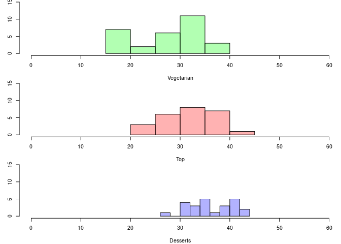

### Richness

    par(mfrow=c(3,1), mar=c(4,3,0,0))
    bins <- seq(0, 20, by=2)
    hist(vege_simple$Richness, ylim=c(0, 20), xlim=c(0, 20), main="", xlab="Vegetarian", col=rgb(0,1,0,0.3), breaks=bins, axes=F)
    axis(side=1, at=bins, labels=bins)
    axis(side=2, at=c(0,10,20), labels=c(0,10,20))
    hist(top_simple$Richness, col=rgb(1, 0, 0, 0.3), ylim=c(0, 20), xlim=c(0, 20), main="", xlab="Top", breaks=bins, axes=F)
    axis(side=1, at=bins, labels=bins)
    axis(side=2, at=c(0,10,20), labels=c(0,10,20))
    hist(dessert_simple$Richness, col=rgb(0, 0, 1, 0.3), ylim=c(0, 20), xlim=c(0, 20), main="", xlab="Desserts", breaks=bins, axes=F)
    axis(side=1, at=bins, labels=bins)
    axis(side=2, at=c(0,10,20), labels=c(0,10,20))

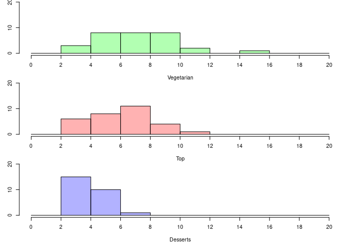

### Shannon

    par(mfrow=c(3,1), mar=c(4,3,0,0))
    bins <- seq(-10, 5, by=1)
    hist(vege_simple$Shannon, ylim=c(0, 20), xlim=c(-10, 5), main="", xlab="Vegetarian", col=rgb(0,1,0,0.3), breaks=bins, axes=F)
    axis(side=1, at=bins, labels=bins)
    axis(side=2, at=c(0,10,20), labels=c(0,10,20))

    hist(top_simple$Shannon, col=rgb(1, 0, 0, 0.3), ylim=c(0, 15), xlim=c(-10, 5), main="", xlab="Top", breaks=bins, axes=F)
    axis(side=1, at=bins, labels=bins)
    axis(side=2, at=c(0,10,20), labels=c(0,10,20))

    hist(dessert_simple$Shannon, col=rgb(0, 0, 1, 0.3), ylim=c(0, 15), xlim=c(-10, 5), main="", xlab="Desserts", breaks=bins, axes=F)
    axis(side=1, at=bins, labels=bins)
    axis(side=2, at=c(0,10,20), labels=c(0,10,20))

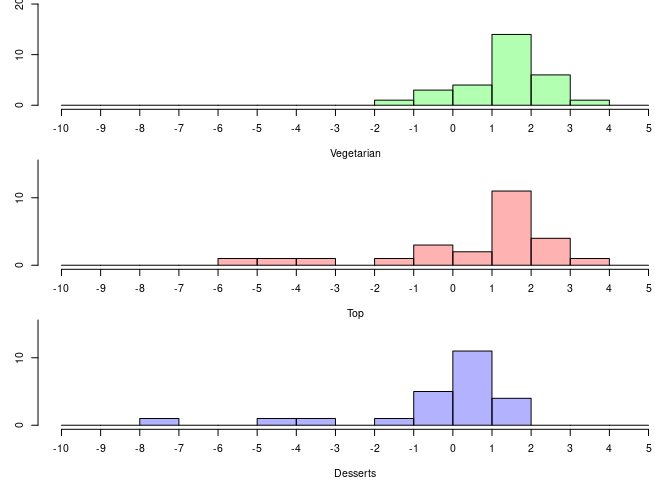

### Simpson

    par(mfrow=c(3,1), mar=c(4,3,0,0))
    bins <- seq(0, 30, by=2)
    hist(vege_simple$Simpson, ylim=c(0, 30), xlim=c(0, 30), main="", xlab="Vegetarian", col=rgb(0,1,0,0.3), breaks=bins, axes=F)
    axis(side=1, at=bins, labels=bins)
    axis(side=2, at=c(0,10,20,30), labels=c(0,10,20,30))

    hist(top_simple$Simpson, col=rgb(1, 0, 0, 0.3), ylim=c(0, 30), xlim=c(0, 30), main="", xlab="Top", breaks=bins, axes=F)
    axis(side=1, at=bins, labels=bins)
    axis(side=2, at=c(0,10,20,30), labels=c(0,10,20,30))

    hist(dessert_simple$Simpson, col=rgb(0, 0, 1, 0.3), ylim=c(0, 30), xlim=c(0, 30), main="", xlab="Desserts", breaks=bins, axes=F)
    axis(side=1, at=bins, labels=bins)
    axis(side=2, at=c(0,10,20,30), labels=c(0,10,20,30))

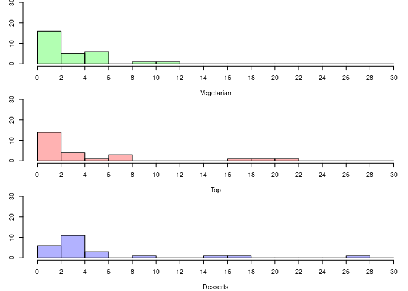

Boxplot
=======

### Phylognetic diversity

    par(mfrow=c(1,1), mar=c(4,3,0,0))
    boxplot(vege_simple$Phylogenetic_diversity, top_simple$Phylogenetic_diversity, dessert_simple$Phylogenetic_diversity, col=c("green", "red", "blue"), names=c("Vegetarien", "top", "dessert"))

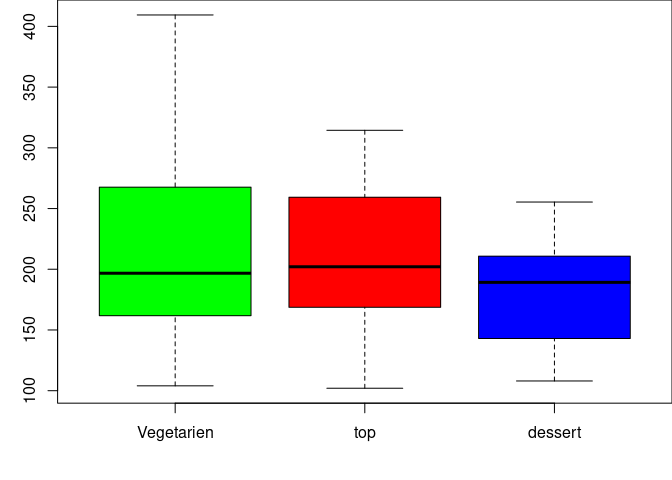

### Weighted phylogenetic diversity

    par(mfrow=c(1,1), mar=c(4,3,0,0))
    boxplot(vege_simple$Weighted_phylogenetic_diversity, top_simple$Weighted_phylogenetic_diversity, dessert_simple$Weighted_phylogenetic_diversity, col=c("green", "red", "blue"), names=c("Vegetarien", "top", "dessert"))

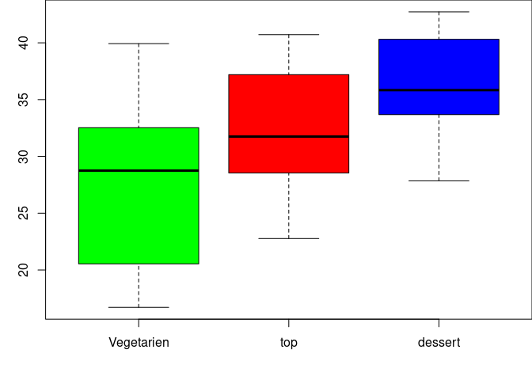

### Richness

    par(mfrow=c(1,1), mar=c(4,3,0,0))
    boxplot(vege_simple$Richness, top_simple$Richness, dessert_simple$Richness, col=c("green", "red", "blue"), names=c("Vegetarien", "top", "dessert"))

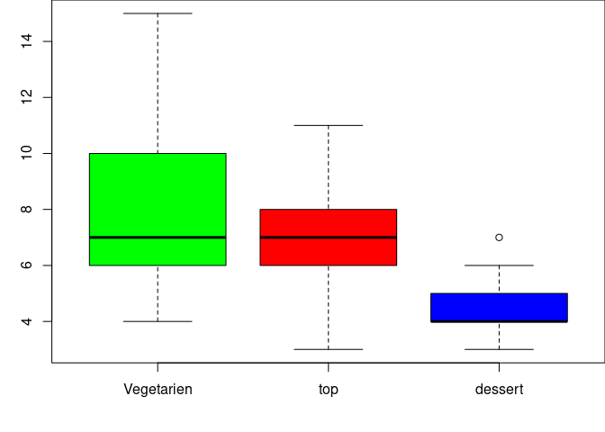

### Shannon

    par(mfrow=c(1,1), mar=c(4,3,0,0))
    boxplot(vege_simple$Shannon, top_simple$Shannon, dessert_simple$Shannon, col=c("green", "red", "blue"), names=c("Vegetarien", "top", "dessert"))

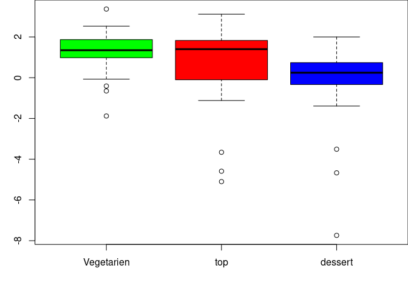

### Simpson

    par(mfrow=c(1,1), mar=c(4,3,0,0))
    boxplot(vege_simple$Simpson, top_simple$Simpson, dessert_simple$Simpson, col=c("green", "red", "blue"), names=c("Vegetarien", "top", "dessert"))

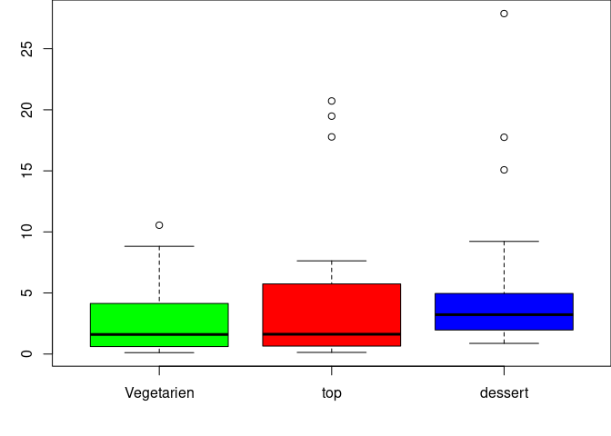

Combining recipes
=================

    all_simple <- rbind(vege_simple, top_simple, dessert_simple)

### Plot wheighted phylogenetic diversity by nutritional values

    par(mfrow=c(3,2), mar=c(4,3,0,0))

    plot(all_simple$Energy, all_simple$Weighted_phylogenetic_diversity, pch=20, col=factor(all_simple$type), main="", xlab="Energy")
    abline(lm(all_simple$Weighted_phylogenetic_diversity ~ all_simple$Energy), lty=2, col="grey")

    plot(all_simple$Water, all_simple$Weighted_phylogenetic_diversity, pch=20, col=factor(all_simple$type), main="", xlab="Water")
    abline(lm(all_simple$Weighted_phylogenetic_diversity ~ all_simple$Glucides), lty=2, col="grey")

    plot(all_simple$Glucides, all_simple$Weighted_phylogenetic_diversity, pch=20, col=factor(all_simple$type), main="", xlab="Glucides")
    abline(lm(all_simple$Weighted_phylogenetic_diversity ~ all_simple$Lipids), lty=2, col="grey")

    plot(all_simple$Proteins, all_simple$Weighted_phylogenetic_diversity, pch=20, col=factor(all_simple$type), ylab="Diversité phylogénétique pondérée", main="", xlab="Proteins")
    abline(lm(all_simple$Weighted_phylogenetic_diversity ~ all_simple$Proteins), lty=2, col="grey")

    plot(all_simple$Lipids, all_simple$Weighted_phylogenetic_diversity, pch=20, col=factor(all_simple$type), main="", xlab="Lipids")
    abline(lm(all_simple$Weighted_phylogenetic_diversity ~ all_simple$Lipids), lty=2, col="grey")

    plot.new()
    legend(x="bottomright", legend=unique(all_simple$type), fill=c("green", "red", "black"))

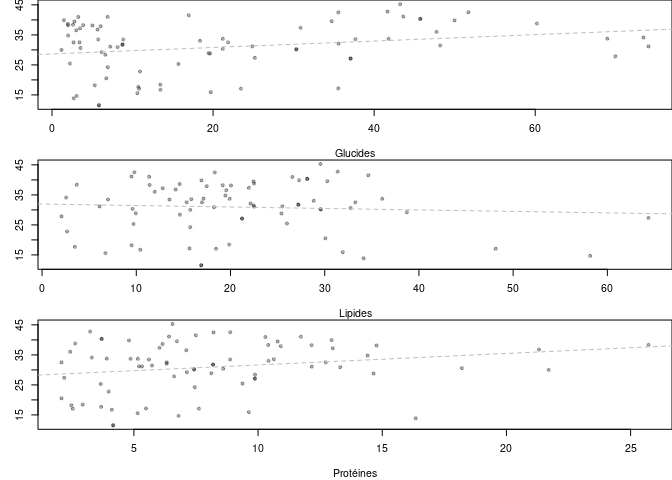

### Correlation with energy

    cor.test(all_simple$Energy, all_simple$Phylogenetic_diversity)

    ## 
    ##  Pearson's product-moment correlation
    ## 
    ## data:  all_simple$Energy and all_simple$Phylogenetic_diversity
    ## t = 0.14135, df = 78, p-value = 0.888
    ## alternative hypothesis: true correlation is not equal to 0
    ## 95 percent confidence interval:
    ##  -0.2044332  0.2348935
    ## sample estimates:
    ##        cor 
    ## 0.01600252

    cor.test(all_simple$Energy, all_simple$Weighted_phylogenetic_diversity)

    ## 
    ##  Pearson's product-moment correlation
    ## 
    ## data:  all_simple$Energy and all_simple$Weighted_phylogenetic_diversity
    ## t = 1.0248, df = 70, p-value = 0.309
    ## alternative hypothesis: true correlation is not equal to 0
    ## 95 percent confidence interval:
    ##  -0.1132858  0.3435655
    ## sample estimates:
    ##       cor 
    ## 0.1215734

### Correlation with watere

    cor.test(all_simple$Water, all_simple$Phylogenetic_diversity)

    ## 
    ##  Pearson's product-moment correlation
    ## 
    ## data:  all_simple$Water and all_simple$Phylogenetic_diversity
    ## t = 0.94234, df = 84, p-value = 0.3487
    ## alternative hypothesis: true correlation is not equal to 0
    ## 95 percent confidence interval:
    ##  -0.1120240  0.3074908
    ## sample estimates:
    ##       cor 
    ## 0.1022789

    cor.test(all_simple$Water, all_simple$Weighted_phylogenetic_diversity)

    ## 
    ##  Pearson's product-moment correlation
    ## 
    ## data:  all_simple$Water and all_simple$Weighted_phylogenetic_diversity
    ## t = -1.7626, df = 76, p-value = 0.08198
    ## alternative hypothesis: true correlation is not equal to 0
    ## 95 percent confidence interval:
    ##  -0.40293918  0.02547591
    ## sample estimates:
    ##        cor 
    ## -0.1981784

### Correlation with sugars

    cor.test(all_simple$Glucides, all_simple$Phylogenetic_diversity)

    ## 
    ##  Pearson's product-moment correlation
    ## 
    ## data:  all_simple$Glucides and all_simple$Phylogenetic_diversity
    ## t = -1.2099, df = 76, p-value = 0.2301
    ## alternative hypothesis: true correlation is not equal to 0
    ## 95 percent confidence interval:
    ##  -0.34930815  0.08775246
    ## sample estimates:
    ##        cor 
    ## -0.1374626

    cor.test(all_simple$Glucides, all_simple$Weighted_phylogenetic_diversity)

    ## 
    ##  Pearson's product-moment correlation
    ## 
    ## data:  all_simple$Glucides and all_simple$Weighted_phylogenetic_diversity
    ## t = 1.6562, df = 68, p-value = 0.1023
    ## alternative hypothesis: true correlation is not equal to 0
    ## 95 percent confidence interval:
    ##  -0.03991043  0.41278516
    ## sample estimates:
    ##       cor 
    ## 0.1969102

### Correlation with lipides

    cor.test(all_simple$Lipids, all_simple$Phylogenetic_diversity)

    ## 
    ##  Pearson's product-moment correlation
    ## 
    ## data:  all_simple$Lipids and all_simple$Phylogenetic_diversity
    ## t = -0.77041, df = 76, p-value = 0.4434
    ## alternative hypothesis: true correlation is not equal to 0
    ## 95 percent confidence interval:
    ##  -0.3045933  0.1371889
    ## sample estimates:
    ##         cor 
    ## -0.08802927

    cor.test(all_simple$Lipids, all_simple$Weighted_phylogenetic_diversity)

    ## 
    ##  Pearson's product-moment correlation
    ## 
    ## data:  all_simple$Lipids and all_simple$Weighted_phylogenetic_diversity
    ## t = 0.29596, df = 68, p-value = 0.7682
    ## alternative hypothesis: true correlation is not equal to 0
    ## 95 percent confidence interval:
    ##  -0.2007990  0.2685779
    ## sample estimates:
    ##        cor 
    ## 0.03586738

### Correlation with proteins

    cor.test(all_simple$Proteins, all_simple$Phylogenetic_diversity)

    ## 
    ##  Pearson's product-moment correlation
    ## 
    ## data:  all_simple$Proteins and all_simple$Phylogenetic_diversity
    ## t = 0.64899, df = 76, p-value = 0.5183
    ## alternative hypothesis: true correlation is not equal to 0
    ## 95 percent confidence interval:
    ##  -0.1507825  0.2919469
    ## sample estimates:
    ##        cor 
    ## 0.07423924

    cor.test(all_simple$Proteins, all_simple$Weighted_phylogenetic_diversity)

    ## 
    ##  Pearson's product-moment correlation
    ## 
    ## data:  all_simple$Proteins and all_simple$Weighted_phylogenetic_diversity
    ## t = 0.51282, df = 68, p-value = 0.6097
    ## alternative hypothesis: true correlation is not equal to 0
    ## 95 percent confidence interval:
    ##  -0.1754646  0.2927726
    ## sample estimates:
    ##        cor 
    ## 0.06206846

Linear model: can we explain phylogenetic diversity based on composition?
=========================================================================

    linear_model <- lm(Phylogenetic_diversity ~ Glucides + Proteins + Lipids, data=all_simple)
    summary(linear_model)

    ## 
    ## Call:
    ## lm(formula = Phylogenetic_diversity ~ Glucides + Proteins + Lipids, 
    ##     data = all_simple)
    ## 
    ## Residuals:
    ##      Min       1Q   Median       3Q      Max 
    ## -104.917  -42.580   -7.903   39.044  119.525 
    ## 
    ## Coefficients:
    ##              Estimate Std. Error t value Pr(>|t|)    
    ## (Intercept) 215.89201   23.25585   9.283 4.86e-14 ***
    ## Glucides     -0.42513    0.36592  -1.162    0.249    
    ## Proteins      0.06126    1.51208   0.041    0.968    
    ## Lipids       -0.51211    0.56238  -0.911    0.365    
    ## ---
    ## Signif. codes:  0 '***' 0.001 '**' 0.01 '*' 0.05 '.' 0.1 ' ' 1
    ## 
    ## Residual standard error: 56.67 on 74 degrees of freedom
    ##   (8 observations deleted due to missingness)
    ## Multiple R-squared:  0.03011,    Adjusted R-squared:  -0.009207 
    ## F-statistic: 0.7658 on 3 and 74 DF,  p-value: 0.5168

    linear_model.p <- lm(Weighted_phylogenetic_diversity ~ Glucides + Proteins + Lipids, data=all_simple)
    summary(linear_model.p)

    ## 
    ## Call:
    ## lm(formula = Weighted_phylogenetic_diversity ~ Glucides + Proteins + 
    ##     Lipids, data = all_simple)
    ## 
    ## Residuals:
    ##      Min       1Q   Median       3Q      Max 
    ## -14.8740  -3.9046  -0.1051   5.8477  10.6961 
    ## 
    ## Coefficients:
    ##             Estimate Std. Error t value Pr(>|t|)    
    ## (Intercept) 25.95394    3.02760   8.572 2.51e-12 ***
    ## Glucides     0.10027    0.04491   2.233    0.029 *  
    ## Proteins     0.30407    0.20397   1.491    0.141    
    ## Lipids       0.05473    0.07094   0.772    0.443    
    ## ---
    ## Signif. codes:  0 '***' 0.001 '**' 0.01 '*' 0.05 '.' 0.1 ' ' 1
    ## 
    ## Residual standard error: 6.654 on 66 degrees of freedom
    ##   (16 observations deleted due to missingness)
    ## Multiple R-squared:  0.0751, Adjusted R-squared:  0.03305 
    ## F-statistic: 1.786 on 3 and 66 DF,  p-value: 0.1583

    all_simple$type <- as.factor(all_simple$type)
    linear_model <- lm(Weighted_phylogenetic_diversity ~ Water + Glucides + Proteins + Lipids + Energy + type, data=all_simple)
    summary(linear_model)

    ## 
    ## Call:
    ## lm(formula = Weighted_phylogenetic_diversity ~ Water + Glucides + 
    ##     Proteins + Lipids + Energy + type, data = all_simple)
    ## 
    ## Residuals:
    ##     Min      1Q  Median      3Q     Max 
    ## -11.957  -4.421   0.744   4.775   9.709 
    ## 
    ## Coefficients:
    ##                  Estimate Std. Error t value Pr(>|t|)    
    ## (Intercept)     43.965547   7.547805   5.825 2.20e-07 ***
    ## Water           -0.031896   0.083224  -0.383 0.702841    
    ## Glucides        -0.176164   0.077170  -2.283 0.025884 *  
    ## Proteins         0.356276   0.210972   1.689 0.096293 .  
    ## Lipids          -0.115770   0.106973  -1.082 0.283339    
    ## Energy           0.001455   0.002243   0.649 0.518853    
    ## typeTop        -13.233486   3.282596  -4.031 0.000154 ***
    ## typeVegetarian -13.505177   2.495194  -5.412 1.07e-06 ***
    ## ---
    ## Signif. codes:  0 '***' 0.001 '**' 0.01 '*' 0.05 '.' 0.1 ' ' 1
    ## 
    ## Residual standard error: 5.614 on 62 degrees of freedom
    ##   (16 observations deleted due to missingness)
    ## Multiple R-squared:  0.3815, Adjusted R-squared:  0.3117 
    ## F-statistic: 5.464 on 7 and 62 DF,  p-value: 6.404e-05

Link between phylogenetic diversity and richness
================================================

    plot(vege_simple$Richness, vege_simple$Phylogenetic_diversity, pch=20, col="green", ylab="Diversité Phylogénétique", xlab="Richesse"  )
    abline(lm(vege_simple$Phylogenetic_diversity ~ vege_simple$Richness), col="green")
    points(top_simple$Richness, top_simple$Phylogenetic_diversity, pch=20, col="red" )
    abline(lm(top_simple$Phylogenetic_diversity ~ top_simple$Richness), col="red")
    points(dessert_simple$Richness, dessert_simple$Phylogenetic_diversity, pch=20, col="blue")
    abline(lm(dessert_simple$Phylogenetic_diversity ~ dessert_simple$Richness), col="blue")

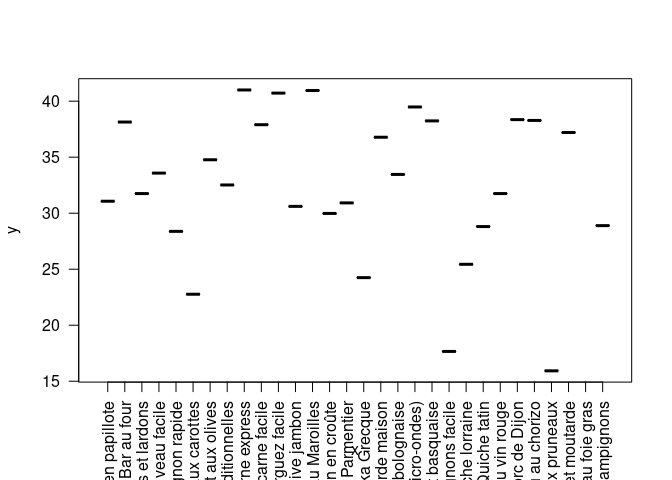

Link between weighted phylogenetic diversity and richness
=========================================================

    plot(vege_simple$Richness, vege_simple$Weighted_phylogenetic_diversity, pch=20, col="green", ylab="Diversité Phylogénétique pondérée", xlab="Richesse")
    abline(lm(vege_simple$Weighted_phylogenetic_diversity ~ vege_simple$Richness), col="green")
    points(top_simple$Richness, top_simple$Weighted_phylogenetic_diversity, pch=20, col="red" )
    abline(lm(top_simple$Weighted_phylogenetic_diversity ~ top_simple$Richness), col="red")
    points(dessert_simple$Richness, dessert_simple$Weighted_phylogenetic_diversity, pch=20, col="blue")
    abline(lm(dessert_simple$Weighted_phylogenetic_diversity ~ dessert_simple$Richness), col="blue")

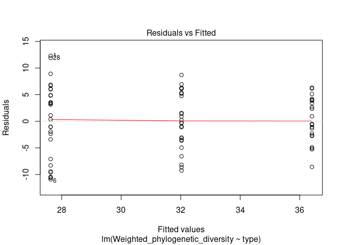

Other plots
===========

### Vegetarian

    plot(vege_simple$Recipe, vege_simple$Weighted_phylogenetic_diversity, las=2)

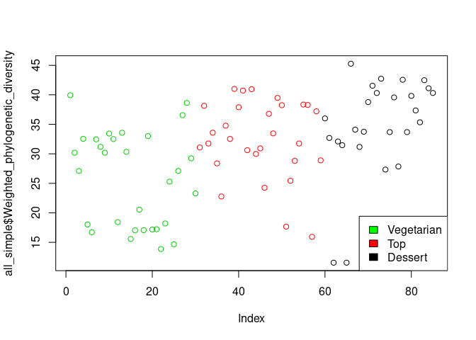

### Top

    plot(top_simple$Recipe, top_simple$Weighted_phylogenetic_diversity, las=2)

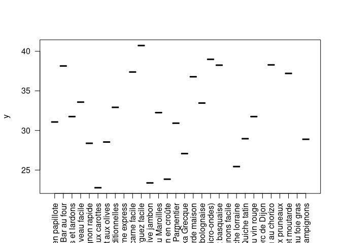

### Dessert

    plot(dessert_simple$Recipe, dessert_simple$Weighted_phylogenetic_diversity, las=2)

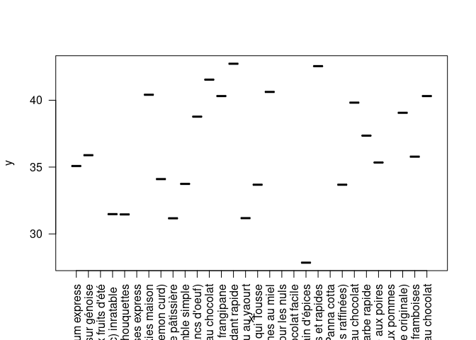

All samples
-----------

    plot(all_simple$Weighted_phylogenetic_diversity, col=factor(all_simple$type), ylab="Weighted phylogenetic diversity")
    legend(x="bottomright", legend=unique(all_simple$type), fill=c("green", "red", "black"))

