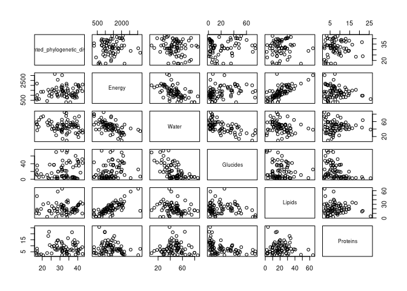
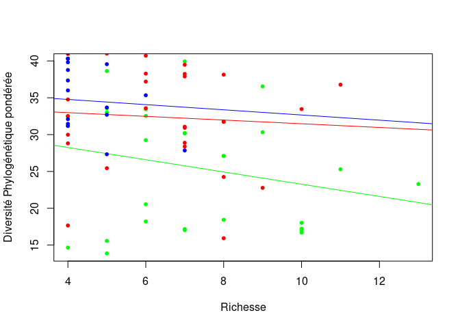
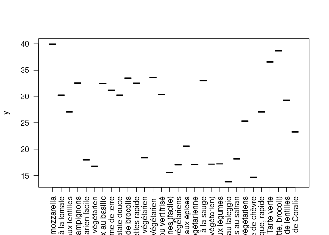

Import libraries
================

Collect data
============

### Vegetarian

    dta_vege <- read.csv("/home/tommaso/diversite-phylogenetique-de-l-assiette-au-jardin/results/Vegetarian/vegetarian_results.tsv", header=TRUE, sep="\t", fill=T)
    summary(dta_vege)

    ##                                                             Recipe   
    ##  Tourte de Noël végétarienne de Coralie                        : 16  
    ##  Burger végétarien aux lentilles                               : 14  
    ##  Ragoût végétarien aux légumes                                 : 14  
    ##  Tarte provençale fine, light, végétarienne, économique, rapide: 14  
    ##  Couscous végétarien facile                                    : 13  
    ##  Paëlla végétarienne                                           : 13  
    ##  (Other)                                                       :219  
    ##          Ingredient            Specie       Quantity     Dry_matter 
    ##  Poivre       : 21   Piper nigrum : 22   1 g    : 43   0.91 g : 21  
    ##  Sel          : 19   Bos taurus   : 19   30 g   : 24   1.0 g  : 19  
    ##  Oignon       : 18   Allium cepa  : 18   120 g  : 18   12.48 g: 11  
    ##  Ail          : 12   Gallus gallus: 14   200 g  : 17   18.96 g:  7  
    ##  Huile d'olive: 12   Olea europaea: 13   5 g    : 17   0.42 g :  6  
    ##  Oeuf         : 12   (Other)      :140   80 g   : 17   (Other):231  
    ##  (Other)      :209   NA's         : 77   (Other):167   NA's   :  8  
    ##      Energy           Water          Glucides         Lipids      
    ##  Min.   :   0.0   Min.   : 0.00   Min.   : 0.00   Min.   :  0.00  
    ##  1st Qu.:  14.9   1st Qu.: 9.00   1st Qu.: 1.80   1st Qu.:  0.36  
    ##  Median : 208.2   Median :67.35   Median : 6.25   Median :  0.63  
    ##  Mean   : 605.4   Mean   :51.56   Mean   :15.01   Mean   : 14.93  
    ##  3rd Qu.: 837.8   3rd Qu.:88.10   3rd Qu.:19.40   3rd Qu.: 11.28  
    ##  Max.   :6280.0   Max.   :98.00   Max.   :99.80   Max.   :100.00  
    ##  NA's   :69       NA's   :7       NA's   :19      NA's   :7       
    ##     Proteins         Richness      Phylogenetic_diversity
    ##  Min.   : 0.000   Min.   : 4.000   Min.   : 58.0         
    ##  1st Qu.: 1.060   1st Qu.: 6.000   1st Qu.:151.7         
    ##  Median : 2.940   Median : 7.000   Median :175.6         
    ##  Mean   : 5.672   Mean   : 7.561   Mean   :185.8         
    ##  3rd Qu.: 9.223   3rd Qu.:10.000   3rd Qu.:250.3         
    ##  Max.   :31.100   Max.   :13.000   Max.   :328.0         
    ##  NA's   :7                                               
    ##  Weighted_phylogenetic_diversity    Shannon          Simpson     
    ##  Min.   :13.87                   Min.   :-0.070   Min.   :0.110  
    ##  1st Qu.:17.22                   1st Qu.: 1.100   1st Qu.:0.330  
    ##  Median :25.29                   Median : 1.560   Median :0.760  
    ##  Mean   :24.95                   Mean   : 1.534   Mean   :1.337  
    ##  3rd Qu.:31.19                   3rd Qu.: 2.010   3rd Qu.:1.980  
    ##  Max.   :39.93                   Max.   : 3.020   Max.   :4.410  
    ##                                                                  
    ##                                                                                                               URL     
    ##  https://www.marmiton.org/recettes/recette_tourte-de-noel-vegetarienne-de-coralie_15536.aspx                    : 16  
    ##  https://www.marmiton.org/recettes/recette_burger-vegetarien-aux-lentilles_345408.aspx                          : 14  
    ##  https://www.marmiton.org/recettes/recette_ragout-vegetarien-aux-legumes_65191.aspx                             : 14  
    ##  https://www.marmiton.org/recettes/recette_tarte-provencale-fine-light-vegetarienne-economique-rapide_38642.aspx: 14  
    ##  https://www.marmiton.org/recettes/recette_couscous-vegetarien-facile_62233.aspx                                : 13  
    ##  https://www.marmiton.org/recettes/recette_paella-vegetarienne_47534.aspx                                       : 13  
    ##  (Other)                                                                                                        :219

### Top

    dta_top <- read.csv("/home/tommaso/diversite-phylogenetique-de-l-assiette-au-jardin/results/Top/top_results.tsv", header=TRUE, sep="\t", fill=T)
    summary(dta_top)

    ##                                                  Recipe            Ingredient 
    ##  Lapin à la moutarde maison                         : 13   Sel          : 21  
    ##  Boeuf braisé aux carottes                          : 12   Poivre       : 20  
    ##  Hachis Parmentier                                  : 12   Oignon       : 15  
    ##  La Vraie Moussaka Grecque                          : 12   Ail          : 11  
    ##  Lasagnes à la bolognaise                           : 12   Beurre       : 10  
    ##  Blanc de poulet aux endives, champignons et lardons: 11   Crème fraîche:  9  
    ##  (Other)                                            :199   (Other)      :185  
    ##             Specie       Quantity     Dry_matter      Energy      
    ##  Bos taurus    : 34   1 g    : 44   1.0 g  : 21   Min.   :   0.0  
    ##  Piper nigrum  : 20   5 g    : 26   0.91 g : 20   1st Qu.:  13.8  
    ##  Allium cepa   : 19   200 g  : 18   12.48 g:  7   Median : 330.0  
    ##  Allium sativum: 11   30 g   : 16   0.72 g :  6   Mean   : 874.1  
    ##  Olea europaea : 11   50 g   : 15   12.2 g :  6   3rd Qu.: 990.0  
    ##  (Other)       :103   15 g   : 14   (Other):188   Max.   :9720.0  
    ##  NA's          : 73   (Other):138   NA's   : 23   NA's   :66      
    ##      Water           Glucides         Lipids          Proteins     
    ##  Min.   : 0.027   Min.   : 0.00   Min.   :  0.00   Min.   : 0.000  
    ##  1st Qu.: 9.000   1st Qu.: 1.01   1st Qu.:  0.50   1st Qu.: 0.715  
    ##  Median :65.100   Median : 4.04   Median :  1.55   Median : 3.175  
    ##  Mean   :50.736   Mean   :13.10   Mean   : 14.31   Mean   : 6.641  
    ##  3rd Qu.:86.675   3rd Qu.:17.25   3rd Qu.: 13.60   3rd Qu.:12.700  
    ##  Max.   :98.100   Max.   :99.80   Max.   :100.00   Max.   :31.100  
    ##  NA's   :21       NA's   :35      NA's   :22       NA's   :21      
    ##     Richness     Phylogenetic_diversity Weighted_phylogenetic_diversity
    ##  Min.   : 1.00   Min.   :  1.0          Min.   : 1.00                  
    ##  1st Qu.: 5.00   1st Qu.:135.0          1st Qu.:28.81                  
    ##  Median : 7.00   Median :200.5          Median :32.52                  
    ##  Mean   : 6.62   Mean   :192.8          Mean   :31.60                  
    ##  3rd Qu.: 8.00   3rd Qu.:229.1          3rd Qu.:37.90                  
    ##  Max.   :11.00   Max.   :314.4          Max.   :41.00                  
    ##                                                                        
    ##     Shannon           Simpson      
    ##  Min.   :-5.1000   Min.   : 0.030  
    ##  1st Qu.:-0.3300   1st Qu.: 0.490  
    ##  Median : 1.2800   Median : 1.340  
    ##  Mean   : 0.3587   Mean   : 4.172  
    ##  3rd Qu.: 1.8300   3rd Qu.: 6.270  
    ##  Max.   : 3.1200   Max.   :20.720  
    ##                                    
    ##                                                                                                       URL     
    ##  https://www.marmiton.org/recettes/recette_lapin-a-la-moutarde-maison_15983.aspx                        : 13  
    ##  https://www.marmiton.org/recettes/recette_boeuf-braise-aux-carottes_13296.aspx                         : 12  
    ##  https://www.marmiton.org/recettes/recette_hachis-parmentier_17639.aspx                                 : 12  
    ##  https://www.marmiton.org/recettes/recette_la-vraie-moussaka-grecque_72593.aspx                         : 12  
    ##  https://www.marmiton.org/recettes/recette_lasagnes-a-la-bolognaise_18215.aspx                          : 12  
    ##  https://www.marmiton.org/recettes/recette_blanc-de-poulet-aux-endives-champignons-et-lardons_35733.aspx: 11  
    ##  (Other)                                                                                                :199

### Dessert

    dta_dessert <- read.csv("/home/tommaso/diversite-phylogenetique-de-l-assiette-au-jardin/results/Dessert/dessert_results.tsv", header=TRUE, sep="\t", fill=T)
    summary(dta_dessert)

    ##                                               Recipe           Ingredient
    ##  Pain d'épices                                   : 11   Oeuf        :20  
    ##  Baba au rhum express                            :  8   Farine      :15  
    ##  Bavarois aux fraises sur génoise                :  8   Beurre      : 9  
    ##  Cheese cake (gâteau au fromage blanc) inratable :  8   Sucre       : 7  
    ##  Chouquettes                                     :  8   Beurre doux : 5  
    ##  Tarte à la rhubarbe rapide                      :  8   Jaune d'oeuf: 5  
    ##  (Other)                                         :107   (Other)     :97  
    ##                Specie      Quantity     Dry_matter      Energy       
    ##  Gallus gallus    :28   100 g  :19   56.88 g :  9   Min.   :    0.0  
    ##  Bos taurus       :24   5 g    :19   131.25 g:  7   1st Qu.:  231.0  
    ##  Saccharum        :22   150 g  :13   37.92 g :  7   Median :  934.4  
    ##  Triticum aestivum:15   240 g  : 9   99.83 g :  6   Mean   : 1366.7  
    ##  Citrus limon     : 4   1 g    : 7   1.0 g   :  5   3rd Qu.: 2220.0  
    ##  (Other)          :28   160 g  : 7   (Other) :118   Max.   :18500.0  
    ##  NA's             :37   (Other):84   NA's    :  6   NA's   :45       
    ##      Water          Glucides         Lipids          Proteins      
    ##  Min.   : 0.00   Min.   : 0.00   Min.   :  0.00   Min.   : 0.0000  
    ##  1st Qu.: 5.40   1st Qu.: 0.85   1st Qu.:  0.20   1st Qu.: 0.5775  
    ##  Median :15.60   Median : 4.90   Median :  1.00   Median : 1.9600  
    ##  Mean   :38.83   Mean   :29.54   Mean   : 15.99   Mean   : 5.8949  
    ##  3rd Qu.:76.30   3rd Qu.:73.70   3rd Qu.:  9.83   3rd Qu.: 9.0300  
    ##  Max.   :97.80   Max.   :99.80   Max.   :100.00   Max.   :86.9000  
    ##  NA's   :6       NA's   :4       NA's   :4        NA's   :4        
    ##     Richness     Phylogenetic_diversity Weighted_phylogenetic_diversity
    ##  Min.   :1.000   Min.   :  1.0          Min.   : 1.00                  
    ##  1st Qu.:3.000   1st Qu.:128.0          1st Qu.:31.46                  
    ##  Median :4.000   Median :164.0          Median :34.10                  
    ##  Mean   :4.108   Mean   :155.1          Mean   :33.36                  
    ##  3rd Qu.:5.000   3rd Qu.:196.0          3rd Qu.:40.19                  
    ##  Max.   :7.000   Max.   :222.6          Max.   :47.00                  
    ##                                                                        
    ##     Shannon            Simpson      
    ##  Min.   :-8.00000   Min.   : 0.070  
    ##  1st Qu.:-0.01000   1st Qu.: 1.810  
    ##  Median : 0.47500   Median : 2.835  
    ##  Mean   :-0.07342   Mean   : 4.218  
    ##  3rd Qu.: 0.95000   3rd Qu.: 3.560  
    ##  Max.   : 1.15000   Max.   :27.860  
    ##                                     
    ##                                                                                                  URL     
    ##  https://www.marmiton.org/recettes/recette_pain-d-epices_11087.aspx                                : 11  
    ##  https://www.marmiton.org/recettes/recette_baba-au-rhum-express_13608.aspx                         :  8  
    ##  https://www.marmiton.org/recettes/recette_bavarois-aux-fraises-sur-genoise_58126.aspx             :  8  
    ##  https://www.marmiton.org/recettes/recette_cheese-cake-gateau-au-fromage-blanc-inratable_20518.aspx:  8  
    ##  https://www.marmiton.org/recettes/recette_chouquettes_30622.aspx                                  :  8  
    ##  https://www.marmiton.org/recettes/recette_tarte-a-la-rhubarbe-rapide_22715.aspx                   :  8  
    ##  (Other)                                                                                           :107

Removing “g” from “dry\_matter” column
======================================

    remove_grams <- function (d) {
      d$Dry_matter <- as.numeric(sapply(d$Dry_matter, sub, pattern=" g", replacement=""))
      return(d)
    }
    dta_vege <- remove_grams(dta_vege)
    dta_top <- remove_grams(dta_top)
    dta_dessert <- remove_grams(dta_dessert)

Trim and grouping by recipe
===========================

    trim_group_data <- function (d) {
      return(
        subset(d, Richness > 2) %>% group_by(Recipe)
      )
    }

    vege_by_recipe <- trim_group_data(dta_vege)
    top_by_recipe <- trim_group_data(dta_top)
    dessert_by_recipe <- trim_group_data(dta_dessert)

Summarize of recipes
====================

    summarise_by_mean <- function (d) {
      return( d %>% summarise(
        Water = weighted.mean(x=Water, w=Dry_matter, na.rm = T), 
        Glucides = weighted.mean(x=Glucides, w=Dry_matter, na.rm = T),
        Lipids = weighted.mean(x=Lipids, w=Dry_matter, na.rm = T),
        Proteins = weighted.mean(x=Proteins, w=Dry_matter, na.rm = T),
        Phylogenetic_diversity = mean(Phylogenetic_diversity, na.rm = T),
        Weighted_phylogenetic_diversity = mean(Weighted_phylogenetic_diversity, na.rm = T),
        Richness = mean(Richness, na.rm = T),
        Shannon = mean(Shannon, na.rm = T),
        Simpson = mean(Simpson, na.rn = T)
      )
      )
    }

    vege_simple <- summarise_by_mean(vege_by_recipe)
    vege_simple$type <- "Vegetarian"
    top_simple <- summarise_by_mean(top_by_recipe)
    top_simple$type <- "Top"
    dessert_simple <- summarise_by_mean(dessert_by_recipe)
    dessert_simple$type <- "Dessert"

Histograms
==========

### Phylogenetic diversity

    par(mfrow=c(3,1), mar=c(4,3,0,0))
    hist(vege_simple$Phylogenetic_diversity, ylim=c(0, 15), xlim=c(50, 350), main="", xlab="Vegetarian", col=rgb(0,1,0,0.3))
    hist(top_simple$Phylogenetic_diversity, col=rgb(1, 0, 0, 0.3), ylim=c(0, 15), xlim=c(50, 350), main="", xlab="Top")
    hist(dessert_simple$Phylogenetic_diversity, col=rgb(0, 0, 1, 0.3), ylim=c(0, 15), xlim=c(50, 350), main="", xlab="Desserts")

### Weighted phylogenetic diversity

    par(mfrow=c(3,1), mar=c(4,3,0,0))
    hist(vege_simple$Weighted_phylogenetic_diversity, ylim=c(0, 15), xlim=c(0, 60), main="", xlab="Vegetarian", col=rgb(0,1,0,0.3))
    hist(top_simple$Weighted_phylogenetic_diversity, col=rgb(1, 0, 0, 0.3), ylim=c(0, 15), xlim=c(0, 60), main="", xlab="Top")
    hist(dessert_simple$Weighted_phylogenetic_diversity, col=rgb(0, 0, 1, 0.3), ylim=c(0, 15), xlim=c(0, 60), main="", xlab="Desserts")

### Richness

    par(mfrow=c(3,1), mar=c(4,3,0,0))
    bins <- seq(0, 20, by=2)
    hist(vege_simple$Richness, ylim=c(0, 20), xlim=c(0, 20), main="", xlab="Vegetarian", col=rgb(0,1,0,0.3), breaks=bins, axes=F)
    axis(side=1, at=bins, labels=bins)
    axis(side=2, at=c(0,10,20), labels=c(0,10,20))
    hist(top_simple$Richness, col=rgb(1, 0, 0, 0.3), ylim=c(0, 20), xlim=c(0, 20), main="", xlab="Top", breaks=bins, axes=F)
    axis(side=1, at=bins, labels=bins)
    axis(side=2, at=c(0,10,20), labels=c(0,10,20))
    hist(dessert_simple$Richness, col=rgb(0, 0, 1, 0.3), ylim=c(0, 20), xlim=c(0, 20), main="", xlab="Desserts", breaks=bins, axes=F)
    axis(side=1, at=bins, labels=bins)
    axis(side=2, at=c(0,10,20), labels=c(0,10,20))

### Shannon

    par(mfrow=c(3,1), mar=c(4,3,0,0))
    bins <- seq(-10, 5, by=1)
    hist(vege_simple$Shannon, ylim=c(0, 20), xlim=c(-10, 5), main="", xlab="Vegetarian", col=rgb(0,1,0,0.3), breaks=bins, axes=F)
    axis(side=1, at=bins, labels=bins)
    axis(side=2, at=c(0,10,20), labels=c(0,10,20))

    hist(top_simple$Shannon, col=rgb(1, 0, 0, 0.3), ylim=c(0, 15), xlim=c(-10, 5), main="", xlab="Top", breaks=bins, axes=F)
    axis(side=1, at=bins, labels=bins)
    axis(side=2, at=c(0,10,20), labels=c(0,10,20))

    hist(dessert_simple$Shannon, col=rgb(0, 0, 1, 0.3), ylim=c(0, 15), xlim=c(-10, 5), main="", xlab="Desserts", breaks=bins, axes=F)
    axis(side=1, at=bins, labels=bins)
    axis(side=2, at=c(0,10,20), labels=c(0,10,20))

### Simpson

    par(mfrow=c(3,1), mar=c(4,3,0,0))
    bins <- seq(0, 30, by=2)
    hist(vege_simple$Simpson, ylim=c(0, 30), xlim=c(0, 30), main="", xlab="Vegetarian", col=rgb(0,1,0,0.3), breaks=bins, axes=F)
    axis(side=1, at=bins, labels=bins)
    axis(side=2, at=c(0,10,20,30), labels=c(0,10,20,30))

    hist(top_simple$Simpson, col=rgb(1, 0, 0, 0.3), ylim=c(0, 30), xlim=c(0, 30), main="", xlab="Top", breaks=bins, axes=F)
    axis(side=1, at=bins, labels=bins)
    axis(side=2, at=c(0,10,20,30), labels=c(0,10,20,30))

    hist(dessert_simple$Simpson, col=rgb(0, 0, 1, 0.3), ylim=c(0, 30), xlim=c(0, 30), main="", xlab="Desserts", breaks=bins, axes=F)
    axis(side=1, at=bins, labels=bins)
    axis(side=2, at=c(0,10,20,30), labels=c(0,10,20,30))

Boxplot
=======

### Phylognetic diversity

    par(mfrow=c(1,1), mar=c(4,3,0,0))
    boxplot(vege_simple$Phylogenetic_diversity, top_simple$Phylogenetic_diversity, dessert_simple$Phylogenetic_diversity, col=c("green", "red", "blue"), names=c("Vegetarien", "top", "dessert"))

### Weighted phylogenetic diversity

    par(mfrow=c(1,1), mar=c(4,3,0,0))
    boxplot(vege_simple$Weighted_phylogenetic_diversity, top_simple$Weighted_phylogenetic_diversity, dessert_simple$Weighted_phylogenetic_diversity, col=c("green", "red", "blue"), names=c("Vegetarien", "top", "dessert"))

### Richness

    par(mfrow=c(1,1), mar=c(4,3,0,0))
    boxplot(vege_simple$Richness, top_simple$Richness, dessert_simple$Richness, col=c("green", "red", "blue"), names=c("Vegetarien", "top", "dessert"))

### Shannon

    par(mfrow=c(1,1), mar=c(4,3,0,0))
    boxplot(vege_simple$Shannon, top_simple$Shannon, dessert_simple$Shannon, col=c("green", "red", "blue"), names=c("Vegetarien", "top", "dessert"))

### Simpson

    par(mfrow=c(1,1), mar=c(4,3,0,0))
    boxplot(vege_simple$Simpson, top_simple$Simpson, dessert_simple$Simpson, col=c("green", "red", "blue"), names=c("Vegetarien", "top", "dessert"))

Combining recipes
=================

    all_simple <- rbind(vege_simple, top_simple, dessert_simple)

### Plot wheighted phylogenetic diversity by nutritional values

    par(mfrow=c(3,1), mar=c(4,3,0,0))
    plot(all_simple$Glucides, all_simple$Weighted_phylogenetic_diversity, pch=20, col=rgb(0,0,0, 0.3), ylab="Diversité phylogénétique pondérée", main="", xlab="Glucides")
    abline(lm(all_simple$Weighted_phylogenetic_diversity ~ all_simple$Glucides), lty=2, col="grey")
    plot(all_simple$Lipids, all_simple$Weighted_phylogenetic_diversity, pch=20, col=rgb(0,0,0, 0.3), ylab="Diversité phylogénétique pondérée", main="", xlab="Lipides")
    abline(lm(all_simple$Weighted_phylogenetic_diversity ~ all_simple$Lipids), lty=2, col="grey")
    plot(all_simple$Proteins, all_simple$Weighted_phylogenetic_diversity, pch=20, col=rgb(0,0,0, 0.3), ylab="Diversité phylogénétique pondérée", main="", xlab="Protéines")
    abline(lm(all_simple$Weighted_phylogenetic_diversity ~ all_simple$Proteins), lty=2, col="grey")

### Correlation with sugars

    cor.test(all_simple$Glucides, all_simple$Phylogenetic_diversity)

    ## 
    ##  Pearson's product-moment correlation
    ## 
    ## data:  all_simple$Glucides and all_simple$Phylogenetic_diversity
    ## t = -0.34022, df = 75, p-value = 0.7346
    ## alternative hypothesis: true correlation is not equal to 0
    ## 95 percent confidence interval:
    ##  -0.2609392  0.1863628
    ## sample estimates:
    ##         cor 
    ## -0.03925456

    cor.test(all_simple$Glucides, all_simple$Weighted_phylogenetic_diversity)

    ## 
    ##  Pearson's product-moment correlation
    ## 
    ## data:  all_simple$Glucides and all_simple$Weighted_phylogenetic_diversity
    ## t = 2.2145, df = 75, p-value = 0.02983
    ## alternative hypothesis: true correlation is not equal to 0
    ## 95 percent confidence interval:
    ##  0.0251502 0.4469144
    ## sample estimates:
    ##       cor 
    ## 0.2477335

### Correlation with lipides

    cor.test(all_simple$Lipids, all_simple$Phylogenetic_diversity)

    ## 
    ##  Pearson's product-moment correlation
    ## 
    ## data:  all_simple$Lipids and all_simple$Phylogenetic_diversity
    ## t = -0.92152, df = 75, p-value = 0.3597
    ## alternative hypothesis: true correlation is not equal to 0
    ## 95 percent confidence interval:
    ##  -0.3221550  0.1210362
    ## sample estimates:
    ##        cor 
    ## -0.1058111

    cor.test(all_simple$Lipids, all_simple$Weighted_phylogenetic_diversity)

    ## 
    ##  Pearson's product-moment correlation
    ## 
    ## data:  all_simple$Lipids and all_simple$Weighted_phylogenetic_diversity
    ## t = -0.57333, df = 75, p-value = 0.5681
    ## alternative hypothesis: true correlation is not equal to 0
    ## 95 percent confidence interval:
    ##  -0.2858075  0.1602931
    ## sample estimates:
    ##         cor 
    ## -0.06605735

### Correlation with proteins

    cor.test(all_simple$Proteins, all_simple$Phylogenetic_diversity)

    ## 
    ##  Pearson's product-moment correlation
    ## 
    ## data:  all_simple$Proteins and all_simple$Phylogenetic_diversity
    ## t = 0.80678, df = 75, p-value = 0.4223
    ## alternative hypothesis: true correlation is not equal to 0
    ## 95 percent confidence interval:
    ##  -0.1340053  0.3102900
    ## sample estimates:
    ##        cor 
    ## 0.09275763

    cor.test(all_simple$Proteins, all_simple$Weighted_phylogenetic_diversity)

    ## 
    ##  Pearson's product-moment correlation
    ## 
    ## data:  all_simple$Proteins and all_simple$Weighted_phylogenetic_diversity
    ## t = 1.8888, df = 75, p-value = 0.06278
    ## alternative hypothesis: true correlation is not equal to 0
    ## 95 percent confidence interval:
    ##  -0.01142955  0.41716297
    ## sample estimates:
    ##       cor 
    ## 0.2130948

Linear model: can we explain phylogenetic diversity based on composition?
=========================================================================

    linear_model <- lm(Phylogenetic_diversity ~ Glucides + Proteins + Lipids, data=all_simple)
    summary(linear_model)

    ## 
    ## Call:
    ## lm(formula = Phylogenetic_diversity ~ Glucides + Proteins + Lipids, 
    ##     data = all_simple)
    ## 
    ## Residuals:
    ##      Min       1Q   Median       3Q      Max 
    ## -133.734  -38.592   -4.539   37.031  138.643 
    ## 
    ## Coefficients:
    ##              Estimate Std. Error t value Pr(>|t|)    
    ## (Intercept) 173.01521   24.76488   6.986  1.1e-09 ***
    ## Glucides     -0.05819    0.38903  -0.150    0.882    
    ## Proteins      0.97583    1.60778   0.607    0.546    
    ## Lipids       -0.53316    0.60864  -0.876    0.384    
    ## ---
    ## Signif. codes:  0 '***' 0.001 '**' 0.01 '*' 0.05 '.' 0.1 ' ' 1
    ## 
    ## Residual standard error: 60.25 on 73 degrees of freedom
    ##   (8 observations deleted due to missingness)
    ## Multiple R-squared:  0.01892,    Adjusted R-squared:  -0.0214 
    ## F-statistic: 0.4692 on 3 and 73 DF,  p-value: 0.7047

    linear_model.p <- lm(Weighted_phylogenetic_diversity ~ Glucides + Proteins + Lipids, data=all_simple)
    summary(linear_model.p)

    ## 
    ## Call:
    ## lm(formula = Weighted_phylogenetic_diversity ~ Glucides + Proteins + 
    ##     Lipids, data = all_simple)
    ## 
    ## Residuals:
    ##      Min       1Q   Median       3Q      Max 
    ## -19.5612  -4.2414  -0.2042   6.1321  12.4692 
    ## 
    ## Coefficients:
    ##              Estimate Std. Error t value Pr(>|t|)    
    ## (Intercept) 21.479038   3.238739   6.632 4.98e-09 ***
    ## Glucides     0.176358   0.050877   3.466 0.000888 ***
    ## Proteins     0.688455   0.210265   3.274 0.001621 ** 
    ## Lipids       0.006533   0.079598   0.082 0.934808    
    ## ---
    ## Signif. codes:  0 '***' 0.001 '**' 0.01 '*' 0.05 '.' 0.1 ' ' 1
    ## 
    ## Residual standard error: 7.88 on 73 degrees of freedom
    ##   (8 observations deleted due to missingness)
    ## Multiple R-squared:  0.1827, Adjusted R-squared:  0.1491 
    ## F-statistic: 5.439 on 3 and 73 DF,  p-value: 0.001972

Link between phylogenetic diversity and richness
================================================

    plot(vege_simple$Richness, vege_simple$Phylogenetic_diversity, pch=20, col="green", ylab="Diversité Phylogénétique", xlab="Richesse"  )
    abline(lm(vege_simple$Phylogenetic_diversity ~ vege_simple$Richness), col="green")
    points(top_simple$Richness, top_simple$Phylogenetic_diversity, pch=20, col="red" )
    abline(lm(top_simple$Phylogenetic_diversity ~ top_simple$Richness), col="red")
    points(dessert_simple$Richness, dessert_simple$Phylogenetic_diversity, pch=20, col="blue")
    abline(lm(dessert_simple$Phylogenetic_diversity ~ dessert_simple$Richness), col="blue")

Link between weighted phylogenetic diversity and richness
=========================================================

    plot(vege_simple$Richness, vege_simple$Weighted_phylogenetic_diversity, pch=20, col="green", ylab="Diversité Phylogénétique pondérée", xlab="Richesse")
    abline(lm(vege_simple$Weighted_phylogenetic_diversity ~ vege_simple$Richness), col="green")
    points(top_simple$Richness, top_simple$Weighted_phylogenetic_diversity, pch=20, col="red" )
    abline(lm(top_simple$Weighted_phylogenetic_diversity ~ top_simple$Richness), col="red")
    points(dessert_simple$Richness, dessert_simple$Weighted_phylogenetic_diversity, pch=20, col="blue")
    abline(lm(dessert_simple$Weighted_phylogenetic_diversity ~ dessert_simple$Richness), col="blue")

Other plots
===========

### Vegetarian

    plot(vege_simple$Recipe, vege_simple$Weighted_phylogenetic_diversity, las=2)

### Top

    plot(top_simple$Recipe, top_simple$Weighted_phylogenetic_diversity, las=2)

### Dessert

    plot(dessert_simple$Recipe, dessert_simple$Weighted_phylogenetic_diversity, las=2)

All samples
-----------

    plot(all_simple$Weighted_phylogenetic_diversity, col=factor(all_simple$type))
    legend(x="bottomright", legend=unique(all_simple$type), fill=c("green", "red", "black"))

