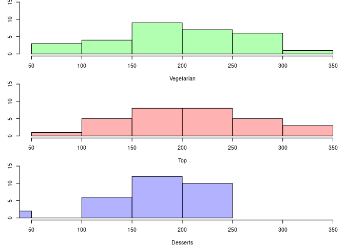
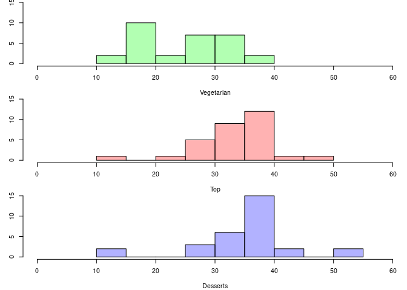
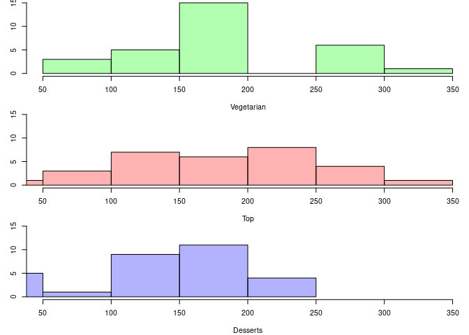

Import libraries
================

    library(naniar)
    library(tidyr)
    library(dplyr)

    ## 
    ## Attaching package: 'dplyr'

    ## The following objects are masked from 'package:stats':
    ## 
    ##     filter, lag

    ## The following objects are masked from 'package:base':
    ## 
    ##     intersect, setdiff, setequal, union

Collect data
============

    dta_vege <- read.csv("/home/tommaso/diversite-phylogenetique-de-l-assiette-au-jardin/results/Vegetarian/vegetarian_results.tsv", header=TRUE, sep="\t", fill=T)
    summary(dta_vege)

    ##                                                            Recette   
    ##  Tourte de Noël végétarienne de Coralie                        : 17  
    ##  Burger végétarien aux lentilles                               : 15  
    ##  Ragoût végétarien aux légumes                                 : 15  
    ##  Tarte provençale fine, light, végétarienne, économique, rapide: 15  
    ##  Couscous végétarien facile                                    : 14  
    ##  Paëlla végétarienne                                           : 14  
    ##  (Other)                                                       :244  
    ##          Ingrédient                   Espèce       Quantité   Matière_sèche
    ##  Poivre       : 21   Piper nigrum        : 27   1 g    : 43   0.91 g : 21  
    ##  Oignon       : 19   Allium cepa         : 20   30 g   : 27   1.0 g  : 19  
    ##  Sel          : 19   Bos taurus          : 19   200 g  : 19   12.48 g: 11  
    ##  Huile d'olive: 13   Gallus gallus       : 17   5 g    : 19   18.96 g:  7  
    ##  Oeuf         : 13   Solanum lycopersicum: 17   120 g  : 18   29.97 g:  7  
    ##  Ail          : 12   (Other)             :192   80 g   : 17   (Other):258  
    ##  (Other)      :237   NA's                : 42   (Other):191   NA's   : 11  
    ##       Eau           Glucides        Lipides         Protéines     
    ##  Min.   : 0.00   Min.   : 0.00   Min.   :  0.00   Min.   : 0.000  
    ##  1st Qu.: 9.00   1st Qu.: 2.25   1st Qu.:  0.36   1st Qu.: 1.060  
    ##  Median :67.80   Median : 6.25   Median :  0.62   Median : 2.820  
    ##  Mean   :53.34   Mean   :15.64   Mean   : 13.37   Mean   : 5.368  
    ##  3rd Qu.:88.20   3rd Qu.:21.40   3rd Qu.:  9.83   3rd Qu.: 9.030  
    ##  Max.   :98.00   Max.   :99.80   Max.   :100.00   Max.   :31.100  
    ##  NA's   :10      NA's   :21      NA's   :9        NA's   :9       
    ##  Diversité.phylogénétique Diversité.phylogénétique.pondérée Indice.de.Shannon
    ##  Min.   : 72.0            Min.   :13.87                     Min.   :-0.060   
    ##  1st Qu.:165.0            1st Qu.:17.85                     1st Qu.: 1.290   
    ##  Median :202.8            Median :24.71                     Median : 1.810   
    ##  Mean   :205.1            Mean   :24.61                     Mean   : 1.718   
    ##  3rd Qu.:258.0            3rd Qu.:30.16                     3rd Qu.: 2.245   
    ##  Max.   :343.5            Max.   :36.55                     Max.   : 3.150   
    ##                                                                              
    ##  Indice.de.Simpson
    ##  Min.   :0.1300   
    ##  1st Qu.:0.4475   
    ##  Median :1.1000   
    ##  Mean   :1.5765   
    ##  3rd Qu.:2.5400   
    ##  Max.   :5.9100   
    ##                   
    ##                                                                                                        URL.de.la.recette
    ##  https://www.marmiton.org/recettes/recette_tourte-de-noel-vegetarienne-de-coralie_15536.aspx                    : 17    
    ##  https://www.marmiton.org/recettes/recette_burger-vegetarien-aux-lentilles_345408.aspx                          : 15    
    ##  https://www.marmiton.org/recettes/recette_ragout-vegetarien-aux-legumes_65191.aspx                             : 15    
    ##  https://www.marmiton.org/recettes/recette_tarte-provencale-fine-light-vegetarienne-economique-rapide_38642.aspx: 15    
    ##  https://www.marmiton.org/recettes/recette_couscous-vegetarien-facile_62233.aspx                                : 14    
    ##  https://www.marmiton.org/recettes/recette_paella-vegetarienne_47534.aspx                                       : 14    
    ##  (Other)                                                                                                        :244

    dta_top <- read.csv("/home/tommaso/diversite-phylogenetique-de-l-assiette-au-jardin/results/Top/top_results.tsv", header=TRUE, sep="\t", fill=T)
    summary(dta_top)

    ##                                                 Recette            Ingrédient 
    ##  Lapin à la moutarde maison                         : 14   Sel          : 21  
    ##  Boeuf braisé aux carottes                          : 13   Poivre       : 20  
    ##  Hachis Parmentier                                  : 13   Ail          : 15  
    ##  La Vraie Moussaka Grecque                          : 13   Oignon       : 15  
    ##  Lasagnes à la bolognaise                           : 13   Beurre       : 10  
    ##  Blanc de poulet aux endives, champignons et lardons: 12   Huile d'olive:  9  
    ##  (Other)                                            :216   (Other)      :204  
    ##             Espèce       Quantité   Matière_sèche      Eau        
    ##  Bos taurus    : 41   1 g    : 44   1.0 g  : 21   Min.   : 0.027  
    ##  Piper nigrum  : 22   5 g    : 26   0.91 g : 20   1st Qu.:10.600  
    ##  Allium cepa   : 19   200 g  : 20   12.48 g:  7   Median :65.450  
    ##  Allium sativum: 16   30 g   : 15   25.76 g:  7   Mean   :52.321  
    ##  Gallus gallus : 15   50 g   : 14   12.88 g:  6   3rd Qu.:86.300  
    ##  (Other)       :136   100 g  : 12   (Other):223   Max.   :98.100  
    ##  NA's          : 45   (Other):163   NA's   : 10   NA's   :8       
    ##     Glucides        Lipides         Protéines      Diversité.phylogénétique
    ##  Min.   : 0.00   Min.   :  0.00   Min.   : 0.000   Min.   : 50.67          
    ##  1st Qu.: 1.01   1st Qu.:  0.47   1st Qu.: 1.100   1st Qu.:187.78          
    ##  Median : 3.90   Median :  1.55   Median : 3.000   Median :221.56          
    ##  Mean   :12.89   Mean   : 13.63   Mean   : 6.973   Mean   :222.45          
    ##  3rd Qu.:18.38   3rd Qu.: 13.60   3rd Qu.:13.000   3rd Qu.:261.33          
    ##  Max.   :99.80   Max.   :100.00   Max.   :36.800   Max.   :346.80          
    ##  NA's   :24      NA's   :8        NA's   :7                                
    ##  Diversité.phylogénétique.pondérée Indice.de.Shannon Indice.de.Simpson
    ##  Min.   :12.83                     Min.   :-7.8700   Min.   : 0.060   
    ##  1st Qu.:31.33                     1st Qu.:-1.8600   1st Qu.: 1.200   
    ##  Median :34.42                     Median : 0.6100   Median : 2.750   
    ##  Mean   :33.65                     Mean   :-0.6467   Mean   : 7.977   
    ##  3rd Qu.:36.68                     3rd Qu.: 1.6700   3rd Qu.: 8.310   
    ##  Max.   :46.47                     Max.   : 3.4900   Max.   :32.560   
    ##                                                                       
    ##                                                                                                URL.de.la.recette
    ##  https://www.marmiton.org/recettes/recette_lapin-a-la-moutarde-maison_15983.aspx                        : 14    
    ##  https://www.marmiton.org/recettes/recette_boeuf-braise-aux-carottes_13296.aspx                         : 13    
    ##  https://www.marmiton.org/recettes/recette_hachis-parmentier_17639.aspx                                 : 13    
    ##  https://www.marmiton.org/recettes/recette_la-vraie-moussaka-grecque_72593.aspx                         : 13    
    ##  https://www.marmiton.org/recettes/recette_lasagnes-a-la-bolognaise_18215.aspx                          : 13    
    ##  https://www.marmiton.org/recettes/recette_blanc-de-poulet-aux-endives-champignons-et-lardons_35733.aspx: 12    
    ##  (Other)                                                                                                :216

    dta_dessert <- read.csv("/home/tommaso/diversite-phylogenetique-de-l-assiette-au-jardin/results/Dessert/dessert_results.tsv", header=TRUE, sep="\t", fill=T)
    summary(dta_dessert)

    ##                                              Recette            Ingrédient 
    ##  Pain d'épices                                   : 12   Oeuf         : 21  
    ##  Baba au rhum express                            :  9   Farine       : 19  
    ##  Bavarois aux fraises sur génoise                :  9   Beurre       : 10  
    ##  Cheese cake (gâteau au fromage blanc) inratable :  9   Sucre        :  8  
    ##  Chouquettes                                     :  9   Sucre vanillé:  8  
    ##  Clafoutis aux cerises express                   :  9   Lait         :  7  
    ##  (Other)                                         :132   (Other)      :116  
    ##                Espèce      Quantité    Matière_sèche      Eau       
    ##  Saccharum        :31   5 g    : 23   56.88 g :  9   Min.   : 0.00  
    ##  Gallus gallus    :29   100 g  : 20   37.92 g :  8   1st Qu.: 4.51  
    ##  Bos taurus       :27   150 g  : 15   131.25 g:  7   Median :15.40  
    ##  Triticum aestivum:19   1 g    :  9   99.83 g :  7   Mean   :35.72  
    ##  Citrus limon     : 5   240 g  :  9   1.0 g   :  6   3rd Qu.:76.30  
    ##  (Other)          :35   160 g  :  8   (Other) :146   Max.   :97.80  
    ##  NA's             :43   (Other):105   NA's    :  6   NA's   :6      
    ##     Glucides        Lipides         Protéines     Diversité.phylogénétique
    ##  Min.   : 0.00   Min.   :  0.00   Min.   : 0.00   Min.   : 30.0           
    ##  1st Qu.: 0.90   1st Qu.:  0.19   1st Qu.: 0.12   1st Qu.:157.3           
    ##  Median : 5.83   Median :  1.00   Median : 1.96   Median :189.0           
    ##  Mean   :34.12   Mean   : 14.93   Mean   : 6.07   Mean   :182.7           
    ##  3rd Qu.:73.70   3rd Qu.:  9.83   3rd Qu.: 9.03   3rd Qu.:218.8           
    ##  Max.   :99.80   Max.   :100.00   Max.   :86.90   Max.   :250.0           
    ##  NA's   :6       NA's   :4        NA's   :4                               
    ##  Diversité.phylogénétique.pondérée Indice.de.Shannon Indice.de.Simpson
    ##  Min.   :11.55                     Min.   :-8.00     Min.   : 0.190   
    ##  1st Qu.:31.46                     1st Qu.:-0.39     1st Qu.: 2.600   
    ##  Median :35.49                     Median : 0.36     Median : 3.510   
    ##  Mean   :34.12                     Mean   :-0.22     Mean   : 5.167   
    ##  3rd Qu.:38.50                     3rd Qu.: 0.83     3rd Qu.: 4.950   
    ##  Max.   :51.00                     Max.   : 1.70     Max.   :27.860   
    ##                                                                       
    ##                                                                                           URL.de.la.recette
    ##  https://www.marmiton.org/recettes/recette_pain-d-epices_11087.aspx                                : 12    
    ##  https://www.marmiton.org/recettes/recette_baba-au-rhum-express_13608.aspx                         :  9    
    ##  https://www.marmiton.org/recettes/recette_bavarois-aux-fraises-sur-genoise_58126.aspx             :  9    
    ##  https://www.marmiton.org/recettes/recette_cheese-cake-gateau-au-fromage-blanc-inratable_20518.aspx:  9    
    ##  https://www.marmiton.org/recettes/recette_chouquettes_30622.aspx                                  :  9    
    ##  https://www.marmiton.org/recettes/recette_clafoutis-aux-cerises-express_17365.aspx                :  9    
    ##  (Other)                                                                                           :132

    dta_ratatouille <- read.csv("/home/tommaso/diversite-phylogenetique-de-l-assiette-au-jardin/results/Ratatouille/Ratatouille.tsv", header=TRUE, sep="\t")

removing “g” from “Matière\_sèche” column
=========================================

    remove_grams <- function (d) {
      d$Matière_sèche <- as.numeric(sapply(d$Matière_sèche, sub, pattern=" g", replacement=""))
      return(d)
    }
    dta_vege<-remove_grams(dta_vege)
    dta_top<-remove_grams(dta_top)
    dta_dessert<-remove_grams(dta_dessert)

grouping by recipe
==================

    vege_by_recipe <- dta_vege %>% group_by(Recette)
    top_by_recipe <- dta_top %>% group_by(Recette)
    dessert_by_recipe <- dta_dessert %>% group_by(Recette)

    summarise_by_mean <- function (d) {
      return( d %>% summarise(
        Eau = weighted.mean(x=Eau, w=Matière_sèche, na.rm = T), 
        Glucides = weighted.mean(x=Glucides, w=Matière_sèche, na.rm = T),
        Lipides = weighted.mean(x=Lipides, w=Matière_sèche, na.rm = T),
        Protéines = weighted.mean(x=Protéines, w=Matière_sèche, na.rm = T),
        Richesse = length(unique(Espèce)),
        Diversité.phylogénétique = mean(Diversité.phylogénétique, na.rm = T),
        Diversité.phylogénétique.pondérée = mean(Diversité.phylogénétique.pondérée, na.rm = T), 
        Indice.de.Shannon = mean(Indice.de.Shannon, na.rm=T),
        Indice.de.Simpson = mean(Indice.de.Simpson, na.rm=T),
      )
      )
    }

    vege_simple <- summarise_by_mean(vege_by_recipe)
    top_simple <- summarise_by_mean(top_by_recipe)
    dessert_simple <- summarise_by_mean(dessert_by_recipe)

### By phylogenetic diversity

    par(mfrow=c(3,1), mar=c(4,3,0,0))
    hist(vege_simple$Diversité.phylogénétique, ylim=c(0, 15), xlim=c(50, 350), main="", xlab="Vegetarian", col=rgb(0,1,0,0.3))
    hist(top_simple$Diversité.phylogénétique, col=rgb(1, 0, 0, 0.3), ylim=c(0, 15), xlim=c(50, 350), main="", xlab="Top")
    hist(dessert_simple$Diversité.phylogénétique, col=rgb(0, 0, 1, 0.3), ylim=c(0, 15), xlim=c(50, 350), main="", xlab="Desserts")

### By weighted phylogenetic diversity

    par(mfrow=c(3,1), mar=c(4,3,0,0))
    hist(vege_simple$Diversité.phylogénétique.pondérée, ylim=c(0, 15), xlim=c(0, 60), main="", xlab="Vegetarian", col=rgb(0,1,0,0.3))
    hist(top_simple$Diversité.phylogénétique.pondérée, col=rgb(1, 0, 0, 0.3), ylim=c(0, 15), xlim=c(0, 60), main="", xlab="Top")
    hist(dessert_simple$Diversité.phylogénétique.pondérée, col=rgb(0, 0, 1, 0.3), ylim=c(0, 15), xlim=c(0, 60), main="", xlab="Desserts")

### Boxplot

    par(mfrow=c(1,1), mar=c(4,3,0,0))
    boxplot(vege_simple$Diversité.phylogénétique.pondérée, top_simple$Diversité.phylogénétique.pondérée, dessert_simple$Diversité.phylogénétique.pondérée, col=c("green", "red", "blue"), names=c("Vegetarien", "top", "dessert"))

Combining recipes
=================

    all_simple <- rbind(vege_simple, top_simple, dessert_simple)

### Plot weighted phylogenetic diversity by nutritional values

    par(mfrow=c(3,1), mar=c(4,3,0,0))
    plot(all_simple$Glucides, all_simple$Diversité.phylogénétique.pondérée, pch=20, col=rgb(0,0,0, 0.3), ylab="Diversité phylogénétique pondérée", main="", xlab="Glucides")
    abline(lm(all_simple$Diversité.phylogénétique.pondérée ~ all_simple$Glucides), lty=2, col="grey")
    plot(all_simple$Lipides, all_simple$Diversité.phylogénétique.pondérée, pch=20, col=rgb(0,0,0, 0.3), ylab="Diversité phylogénétique pondérée", main="", xlab="Lipides")
    abline(lm(all_simple$Diversité.phylogénétique.pondérée ~ all_simple$Lipides), lty=2, col="grey")
    plot(all_simple$Protéines, all_simple$Diversité.phylogénétique.pondérée, pch=20, col=rgb(0,0,0, 0.3), ylab="Diversité phylogénétique pondérée", main="", xlab="Protéines")
    abline(lm(all_simple$Diversité.phylogénétique.pondérée ~ all_simple$Protéines), lty=2, col="grey")

### Correlation with sugars

    cor.test(all_simple$Glucides, all_simple$Diversité.phylogénétique)

    ## 
    ##  Pearson's product-moment correlation
    ## 
    ## data:  all_simple$Glucides and all_simple$Diversité.phylogénétique
    ## t = -0.6229, df = 79, p-value = 0.5351
    ## alternative hypothesis: true correlation is not equal to 0
    ## 95 percent confidence interval:
    ##  -0.2839252  0.1507406
    ## sample estimates:
    ##         cor 
    ## -0.06990982

    cor.test(all_simple$Glucides, all_simple$Diversité.phylogénétique.pondérée)

    ## 
    ##  Pearson's product-moment correlation
    ## 
    ## data:  all_simple$Glucides and all_simple$Diversité.phylogénétique.pondérée
    ## t = 1.942, df = 79, p-value = 0.0557
    ## alternative hypothesis: true correlation is not equal to 0
    ## 95 percent confidence interval:
    ##  -0.005133848  0.412575048
    ## sample estimates:
    ##       cor 
    ## 0.2134548

### Correlation with lipides

    cor.test(all_simple$Lipides, all_simple$Diversité.phylogénétique)

    ## 
    ##  Pearson's product-moment correlation
    ## 
    ## data:  all_simple$Lipides and all_simple$Diversité.phylogénétique
    ## t = -0.76527, df = 79, p-value = 0.4464
    ## alternative hypothesis: true correlation is not equal to 0
    ## 95 percent confidence interval:
    ##  -0.2985400  0.1350974
    ## sample estimates:
    ##        cor 
    ## -0.0857824

    cor.test(all_simple$Lipides, all_simple$Diversité.phylogénétique.pondérée)

    ## 
    ##  Pearson's product-moment correlation
    ## 
    ## data:  all_simple$Lipides and all_simple$Diversité.phylogénétique.pondérée
    ## t = -1.4217, df = 79, p-value = 0.159
    ## alternative hypothesis: true correlation is not equal to 0
    ## 95 percent confidence interval:
    ##  -0.36375197  0.06255938
    ## sample estimates:
    ##        cor 
    ## -0.1579476

### Correlation with proteins

    cor.test(all_simple$Protéines, all_simple$Diversité.phylogénétique)

    ## 
    ##  Pearson's product-moment correlation
    ## 
    ## data:  all_simple$Protéines and all_simple$Diversité.phylogénétique
    ## t = 1.4447, df = 79, p-value = 0.1525
    ## alternative hypothesis: true correlation is not equal to 0
    ## 95 percent confidence interval:
    ##  -0.06001715  0.36596409
    ## sample estimates:
    ##       cor 
    ## 0.1604347

    cor.test(all_simple$Protéines, all_simple$Diversité.phylogénétique.pondérée)

    ## 
    ##  Pearson's product-moment correlation
    ## 
    ## data:  all_simple$Protéines and all_simple$Diversité.phylogénétique.pondérée
    ## t = 2.2162, df = 79, p-value = 0.02955
    ## alternative hypothesis: true correlation is not equal to 0
    ## 95 percent confidence interval:
    ##  0.02490403 0.43719172
    ## sample estimates:
    ##       cor 
    ## 0.2419378

Linear model: can we explain phylogenetic diversity based on composition?
=========================================================================

    linear_model <- lm(Diversité.phylogénétique ~ Glucides + Protéines + Lipides, data=all_simple)
    summary(linear_model)

    ## 
    ## Call:
    ## lm(formula = Diversité.phylogénétique ~ Glucides + Protéines + 
    ##     Lipides, data = all_simple)
    ## 
    ## Residuals:
    ##      Min       1Q   Median       3Q      Max 
    ## -170.579  -32.349   -1.404   37.689  150.836 
    ## 
    ## Coefficients:
    ##              Estimate Std. Error t value Pr(>|t|)    
    ## (Intercept) 181.77720   27.55429   6.597 4.77e-09 ***
    ## Glucides     -0.03084    0.40347  -0.076    0.939    
    ## Protéines     1.59466    1.50161   1.062    0.292    
    ## Lipides      -0.30829    0.67488  -0.457    0.649    
    ## ---
    ## Signif. codes:  0 '***' 0.001 '**' 0.01 '*' 0.05 '.' 0.1 ' ' 1
    ## 
    ## Residual standard error: 64.23 on 77 degrees of freedom
    ##   (9 observations deleted due to missingness)
    ## Multiple R-squared:  0.02841,    Adjusted R-squared:  -0.009443 
    ## F-statistic: 0.7506 on 3 and 77 DF,  p-value: 0.5253

    linear_model.p <- lm(Diversité.phylogénétique.pondérée ~ Glucides + Protéines + Lipides, data=all_simple)
    summary(linear_model.p)

    ## 
    ## Call:
    ## lm(formula = Diversité.phylogénétique.pondérée ~ Glucides + 
    ##     Protéines + Lipides, data = all_simple)
    ## 
    ## Residuals:
    ##      Min       1Q   Median       3Q      Max 
    ## -25.3066  -4.2353   0.7281   4.8855  20.3509 
    ## 
    ## Coefficients:
    ##               Estimate Std. Error t value Pr(>|t|)    
    ## (Intercept) 21.7976745  3.2843304   6.637 4.01e-09 ***
    ## Glucides     0.1671770  0.0480920   3.476 0.000839 ***
    ## Protéines    0.6402987  0.1789845   3.577 0.000604 ***
    ## Lipides     -0.0006625  0.0804422  -0.008 0.993450    
    ## ---
    ## Signif. codes:  0 '***' 0.001 '**' 0.01 '*' 0.05 '.' 0.1 ' ' 1
    ## 
    ## Residual standard error: 7.656 on 77 degrees of freedom
    ##   (9 observations deleted due to missingness)
    ## Multiple R-squared:  0.196,  Adjusted R-squared:  0.1647 
    ## F-statistic: 6.257 on 3 and 77 DF,  p-value: 0.0007397

Link between phylogenetic diversity and richness
plot(vege_simple$Richesse, vege_simple$Diversité.phylogénétique, pch=20, col="green", ylab="Diversité Phylogénétique", xlab="Richesse"  )
abline(lm(vege_simple$Diversité.phylogénétique ~ vege_simple$Richesse), col="green")
points(top_simple$Richesse, top_simple$Diversité.phylogénétique, pch=20, col="red" )
abline(lm(top_simple$Diversité.phylogénétique ~ top_simple$Richesse), col="red")
points(dessert_simple$Richesse, dessert_simple$Diversité.phylogénétique, pch=20, col="blue")
abline(lm(dessert_simple$Diversité.phylogénétique ~ dessert_simple$Richesse), col="blue")

plot(vege_simple$Richesse, vege_simple$Diversité.phylogénétique.pondérée, pch=20, col="green", ylab="Diversité Phylogénétique pondérée", xlab="Richesse"  )
abline(lm(vege_simple$Diversité.phylogénétique.pondérée ~ vege_simple$Richesse), col="green")
points(top_simple$Richesse, top_simple$Diversité.phylogénétique.pondérée, pch=20, col="red" )
abline(lm(top_simple$Diversité.phylogénétique.pondérée ~ top_simple$Richesse), col="red")
points(dessert_simple$Richesse, dessert_simple$Diversité.phylogénétique.pondérée, pch=20, col="blue")
abline(lm(dessert_simple$Diversité.phylogénétique.pondérée ~ dessert_simple$Richesse), col="blue")

boxplot(vege_simple$Richesse, top_simple$Richesse, dessert_simple$Richesse)
boxplot(vege_simple$Diversité.phylogénétique, top_simple$Diversité.phylogénétique, dessert_simple$Diversité.phylogénétique)

boxplot(vege_simple$Diversité.phylogénétique, top_simple$Diversité.phylogénétique, dessert_simple$Diversité.phylogénétique)

par(mar=c(3,3,0,0))
boxplot(vege_simple$Indice.de.Shannon, top_simple$Indice.de.Shannon, dessert_simple$Indice.de.Shannon)

boxplot(vege_simple$Indice.de.Simpson, top_simple$Indice.de.Simpson, dessert_simple$Indice.de.Simpson)

par(mar=c(10,3,0,0))
plot(vege_simple$Recette, vege_simple$Diversité.phylogénétique, las=2)

plot(vege_simple$Recette, vege_simple$Diversité.phylogénétique.pondérée, las=2)

all_simple$origine <- c(rep(times=30, "Vegetarian"), rep(times=30, "Top"), rep(times=30, "Dessert"))

